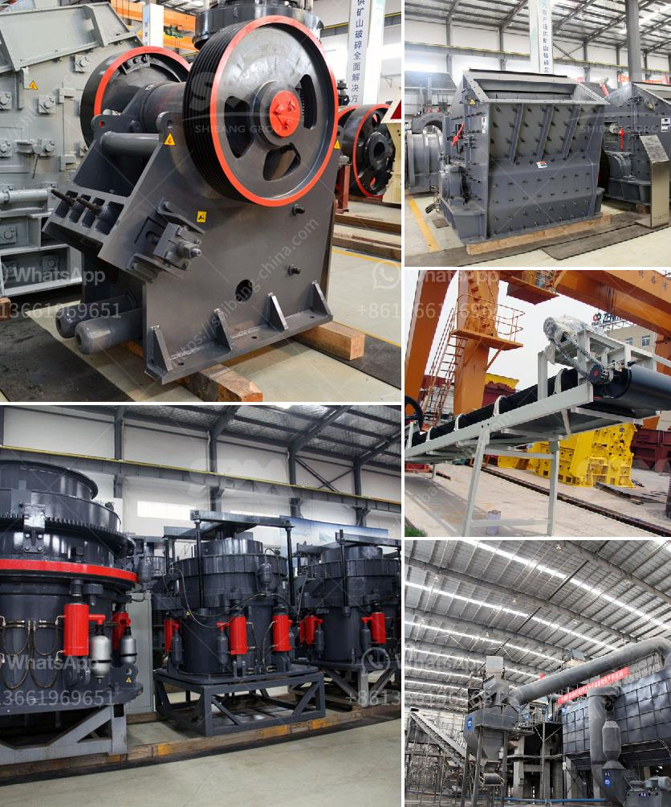

<h3>1 tonne roller mill</h3>
The 1 tonne roller mill is a versatile and efficient piece of equipment that can greatly enhance the productivity of a flour mill or feed mill operation. With its ability to process a wide range of grains and materials, this powerful machine has become a staple in many industrial settings.

First and foremost, the 1 tonne roller mill is known for its exceptional grinding capability. Equipped with multiple sets of high-quality steel rollers, this mill can crush and grind grains into a fine powder with ease. Whether it is wheat, corn, barley, or other grains, the roller mill ensures a consistent particle size, promoting better overall milling performance.

One of the key advantages of the 1 tonne roller mill lies in its ability to handle large volumes of grains in a short amount of time. With its robust frame and powerful motor, this machine can process up to 2,000 kilograms of grains per hour. This remarkable throughput ensures that milling operations can run smoothly and efficiently, leading to higher overall production rates.

In addition to its grinding capabilities, the roller mill is also highly customizable to suit different milling needs. It can be equipped with various attachments and accessories to handle different types of materials. For example, a special roller attachment can be added to handle oilseeds like soybeans or rapeseed, allowing for a more diverse range of products to be processed.

The 1 tonne roller mill is also designed with ease of maintenance in mind. Its durable construction and high-quality components reduce the risk of breakdowns and minimize downtime. Regular maintenance tasks such as roller reconditioning and lubrication can be easily performed, ensuring that the mill operates at its peak performance for years to come.

Furthermore, this roller mill is equipped with advanced safety features to protect both operators and the machine itself. Safety switches and guards are in place to prevent accidents and ensure that the mill only operates when all safety measures are met. This commitment to safety ensures peace of mind for mill operators and allows them to focus on the task at hand without unnecessary risks.

In conclusion, the 1 tonne roller mill is a versatile and powerful machine that has revolutionized the milling industry. Its exceptional grinding capability, high throughput, and customizable features make it an indispensable tool for flour and feed mill operations. With its ease of maintenance and commitment to safety, this roller mill is sure to enhance productivity and efficiency in any industrial setting.
<h3>Contact us</h3><ul><li><strong>Whatsapp:&nbsp;<a href="https://wa.me/8613661969651">+8613661969651</a></strong></li><li><a href="https://swt.shibang-china.com/?git&amp;zhl&amp;1 tonne roller mill"><strong>Online Service(chat now)</strong></a></li></ul><h3>Related</h3><ul><li><a href='quarry and mining crusher equipment.md'>quarry and mining crusher equipment</a></li><li><a href='steed conveyor belting.md'>steed conveyor belting</a></li><li><a href='dolomite crushing plant.md'>dolomite crushing plant</a></li><li><a href='vertical roller mill industrial.md'>vertical roller mill industrial</a></li><li><a href='300ton per hour stone crusher.md'>300ton per hour stone crusher</a></li></ul>