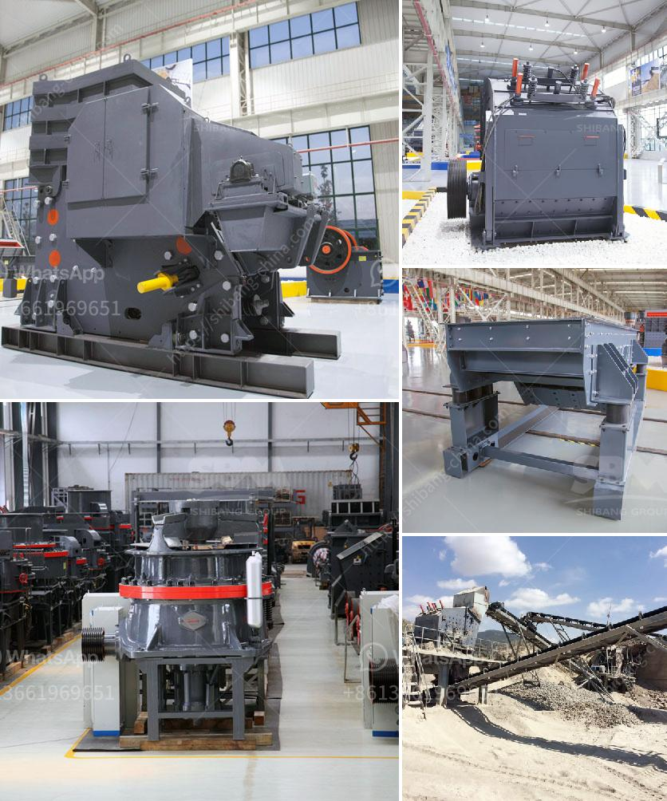

<h3>100tpd cement plant cost in india</h3>
The cement industry is next in line after the steel industry when it comes to the implementation of manufacturing solutions in India. It is estimated that the country's cement sector would require an investment of about INR 210 billion by 2023. 100tpd cement plant refers to the kiln equipped with a capacity of 100 tons per day, which means the cement production process is completed in one day. So, according to the data, theoretical daily output of 100tpd cement plant is 100 tons.

As the market capitalization of cement production further expands, the increase in construction and infrastructure projects in the country is fueling the demand for cement. Setting up a cement plant in India comes with its own set of challenges, primarily the investment required for land, machinery, and workforce. In the case of a 100tpd cement plant, the cost of land, machinery, and equipment will reach approximately INR 25-30 crores. 

A critical factor in cement production is energy efficiency. With advances in technology, newer cement plants are designed to optimize power consumption. Efficient use of energy not only helps reduce costs but also minimizes environmental impact. Therefore, it is essential to consider investing in energy-efficient equipment and adopting sustainable practices during the plant construction.

Other cost factors to consider include infrastructure development, permissions and clearances, transportation, and raw material procurement. With proper planning and execution, these costs can be optimized, ensuring the overall cost of establishing a 100tpd cement plant in India remains within budget.

In conclusion, the cost of setting up a 100tpd cement plant in India depends on several factors such as location, machinery, and technology. It is crucial for investors to conduct a detailed feasibility study and cost analysis before making any investment decisions in the cement industry.
<h3>Contact us</h3><ul><li><strong>Whatsapp:&nbsp;<a href="https://wa.me/8613661969651">+8613661969651</a></strong></li><li><a href="https://swt.shibang-china.com/?git&amp;zhl&amp;100tpd cement plant cost in india"><strong>Online Service(chat now)</strong></a></li></ul><h3>Related</h3><ul><li><a href='artificial sand making from sandstone.md'>artificial sand making from sandstone</a></li><li><a href='price of stone crusher.md'>price of stone crusher</a></li><li><a href='ball grinding machine in india.md'>ball grinding machine in india</a></li><li><a href='ball mill china making.md'>ball mill china making</a></li><li><a href='manufacture of vibrating screens.md'>manufacture of vibrating screens</a></li></ul>