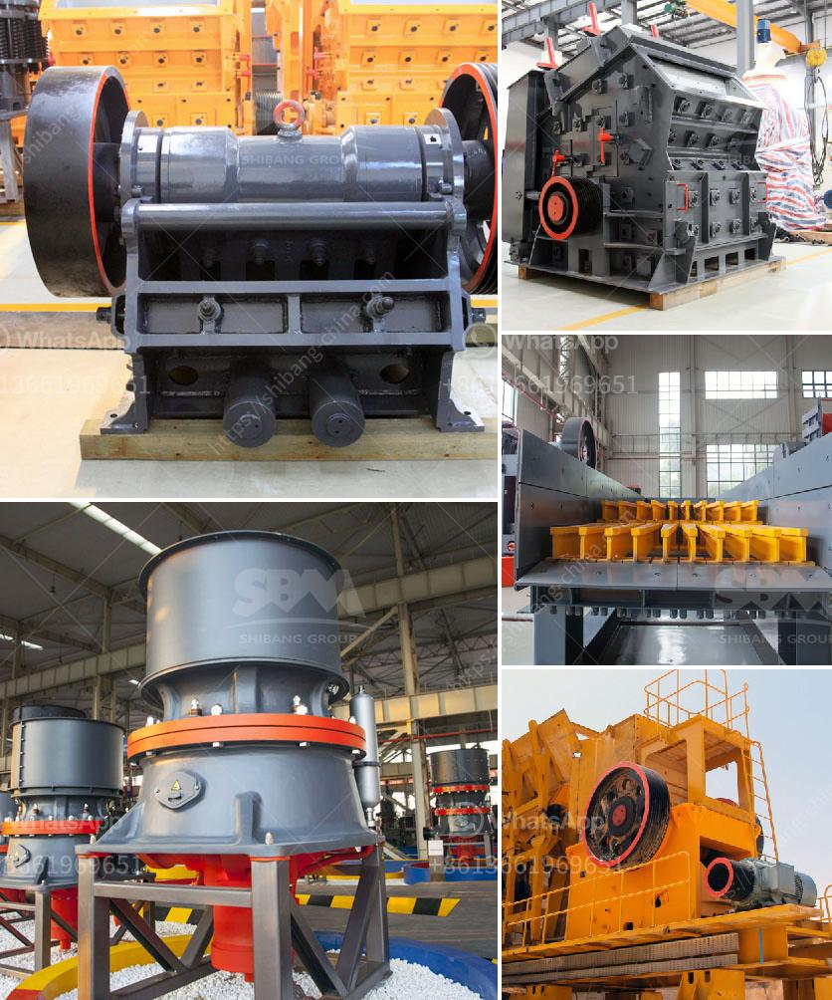

<h3>100tpd cement plant in india</h3>
India is the second largest producer of cement in the world, and as a developing country, it is experiencing a rapid growth in its infrastructure. With this boom in infrastructure, the demand for cement is also increasing day by day. To meet this rising demand, many cement plants are being set up all across the country. One such plant that has caught the attention of many investors and experts is the 100 TPD cement plant in India.

The 100 TPD cement plant in India is based on the vertical shaft kiln technology or VSK, which is considered as an environmentally friendly technology. The plant is small and easy to operate, with a low investment cost and a high cement production rate. It has a capacity of producing 100 tons of cement per day, which makes it ideal for small-scale cement production.

One of the key advantages of the 100 TPD cement plant is that it is cost-effective. It requires less capital investment compared to larger cement plants, making it financially viable for small and medium-sized enterprises. Additionally, the plant can be set up in a short period of time, allowing for quick returns on investment.

Moreover, the 100 TPD cement plant in India is known for its low energy consumption. As the plant uses vertical shaft kiln technology, it consumes less energy compared to traditional cement plants. This not only reduces the carbon footprint but also results in lower production costs.

Another notable feature of the 100 TPD cement plant in India is its high-quality cement production. The plant follows strict quality control measures to ensure that the cement produced meets all the necessary standards and specifications. This high-quality cement can be used in various construction projects, including residential buildings, commercial complexes, and infrastructure projects.

In addition to its economic and environmental advantages, the 100 TPD cement plant in India also plays a crucial role in employment generation. The plant provides job opportunities for local skilled and unskilled workers, contributing to the overall development of the region. This also helps in reducing unemployment and poverty levels in the area.

Overall, the 100 TPD cement plant in India is a promising venture for investors and entrepreneurs. It combines cost-effective production, high-quality cement, and employment generation, making it an attractive option in the cement industry. As India continues to witness a surge in infrastructure development, the demand for cement will keep increasing, making the 100 TPD cement plant an essential part of the country's growth story.
<h3>Contact us</h3><ul><li><strong>Whatsapp:&nbsp;<a href="https://wa.me/8613661969651">+8613661969651</a></strong></li><li><a href="https://swt.shibang-china.com/?git&amp;zhl&amp;100tpd cement plant in india"><strong>Online Service(chat now)</strong></a></li></ul><h3>Related</h3><ul><li><a href='cement mill motor for sale uk.md'>cement mill motor for sale uk</a></li><li><a href='stone crusher plant project report pdf.md'>stone crusher plant project report pdf</a></li><li><a href='grinding milling equipment in south africa.md'>grinding milling equipment in south africa</a></li><li><a href='ball mill prices and for sale ghana.md'>ball mill prices and for sale ghana</a></li><li><a href='german cement grinding unit operations.md'>german cement grinding unit operations</a></li></ul>