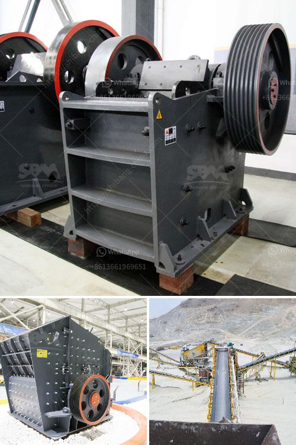

<h3>100tpd complete gold plant</h3>
A 100tpd complete gold plant is a state-of-the-art facility that utilizes cutting-edge technology to extract gold from ore. This plant can process 100 tons of ore per day and is designed to produce high-quality gold bars.

The process begins with crushing and grinding the ore to a fine powder. This is achieved using crushers and mills, which break down the large rocks into smaller particles. Once the ore is finely ground, it is mixed with water and chemicals in flotation tanks. The chemicals help to separate the gold from the waste material.

The next step is called the carbon-in-leach (CIL) process, where activated carbon is added to the slurry. The gold attaches itself to the carbon particles, forming a solid compound. The slurry is then passed through a series of tanks where the gold-loaded carbon is separated from the remaining slurry.

The gold-loaded carbon is then sent to a furnace, where it is heated to extremely high temperatures. This causes the gold to melt and separate from the carbon, creating gold bars. These bars are then cooled and solidified before being ready for sale.

This 100tpd complete gold plant not only utilizes advanced technology but also follows strict environmental and safety regulations. The facility is designed to minimize the impact on the surroundings and ensure the safety of workers. Measures are in place to contain any potential leakage or spillage of chemicals, and waste materials are properly disposed of to minimize environmental contamination.

In conclusion, a 100tpd complete gold plant is a highly efficient and modern facility that can process large quantities of ore to produce high-quality gold bars. It utilizes state-of-the-art technology and follows strict environmental and safety regulations to ensure the best possible outcome.
<h3>Contact us</h3><ul><li><strong>Whatsapp:&nbsp;<a href="https://wa.me/8613661969651">+8613661969651</a></strong></li><li><a href="https://swt.shibang-china.com/?git&amp;zhl&amp;100tpd complete gold plant"><strong>Online Service(chat now)</strong></a></li></ul><h3>Related</h3><ul><li><a href='limestone processing flow sheet.md'>limestone processing flow sheet</a></li><li><a href='cost of converyer belts in south africa.md'>cost of converyer belts in south africa</a></li><li><a href='100tpd cement plant in india.md'>100tpd cement plant in india</a></li><li><a href='talcum powder philling machine.md'>talcum powder philling machine</a></li><li><a href='kohinoor stone crusher contact.md'>kohinoor stone crusher contact</a></li></ul>