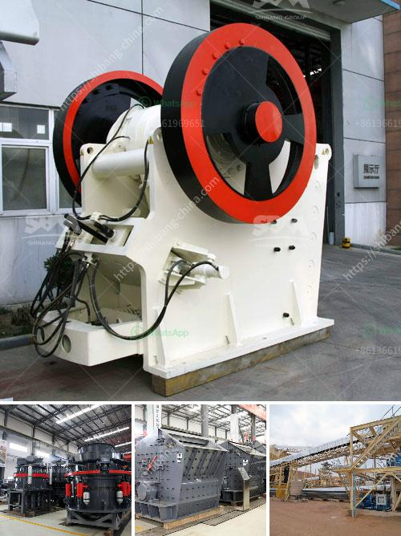

<h3>100tph gold ore processing plant</h3>
A 100tph gold ore processing plant is a key equipment to extract the precious metal from the ore. The main components are jaw crusher, ball mill, spiral classifier, flotation machine, vibrating screen, belt conveyor and so on. The quantity of each equipment depends on the specific production requirements of the ore processing plant.

While extracting gold, the ores are firstly crushed into small size, and then the crushed material is sent to the ball mill for further grinding. The ground gold ore is classified by the spiral classifier, and the unqualified ore is sent back to the ball mill for further grinding until it meets the requirements. The qualified ore is sent to the flotation machine for different mineral separation processes.

Flotation is a widely used method for extracting gold from gold ore. In this process, the mixed gold ore is finely ground to a particle size of 74-200 mesh, and then treated with a flotation agent, such as a collector and a foaming agent. The gold ore is then subjected to several flotation stages to achieve the desired gold concentrate grade.

After the flotation process, the gold concentrate is obtained, and then it is sent to the vibrating screen for screening and desliming. The screened gold concentrate is further processed by a belt conveyor and sent to the gold smelting furnace for smelting and casting to obtain the final gold product.

A 100tph gold ore processing plant not only greatly improves the recovery rate of gold, but also reduces the waste of valuable resources, maximizes the economic benefits of the mining enterprise, and greatly improves the overall processing efficiency. It is an important equipment for the mineral processing industry.

In conclusion, a 100tph gold ore processing plant is a crucial and essential equipment for mining enterprises to extract gold from ore efficiently. It combines several process steps into one unit, saving a lot of transportation, installation, and maintenance costs, and providing reliable and high-quality equipment for mineral processing operations.
<h3>Contact us</h3><ul><li><strong>Whatsapp:&nbsp;<a href="https://wa.me/8613661969651">+8613661969651</a></strong></li><li><a href="https://swt.shibang-china.com/?git&amp;zhl&amp;100tph gold ore processing plant"><strong>Online Service(chat now)</strong></a></li></ul><h3>Related</h3><ul><li><a href='business plan for small mining processing plant.md'>business plan for small mining processing plant</a></li><li><a href='how to find out to crushing capacity of ball mill.md'>how to find out to crushing capacity of ball mill</a></li><li><a href='marble processing plant in uae.md'>marble processing plant in uae</a></li><li><a href='list of mineral processing plants in oman.md'>list of mineral processing plants in oman</a></li><li><a href='quarry machines for sale in kenya.md'>quarry machines for sale in kenya</a></li></ul>