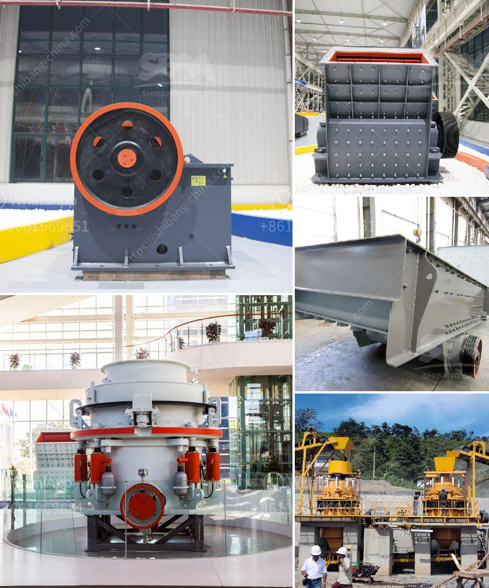

<h3>125 hp cone crusher</h3>
The cone crusher is a powerful crushing machine that is used in mining, construction, and many other industries. It combines high crushing capability with versatility, making it suitable for a wide range of applications.

The 125 hp cone crusher is a machine that crushes hard materials. Cone crushers are widely used in mining, construction, and many other industries to handle hard materials, which may require a lot of power to break down. They have a large chamber, where the materials are fed into the machine and crushed until they reach the desired size.

One of the main advantages of a cone crusher is its versatility. It can be used in different applications, depending on the type of material being crushed. For example, in mining, the cone crusher can be used to crush ore, which may contain gold, copper, or other valuable minerals. In construction, it can be used to crush stones, rocks, or even concrete.

The 125 hp cone crusher has a powerful motor that enables it to crush hard materials with ease. The motor provides a high horsepower, which allows the machine to deliver high crushing capacity. This means that the crusher can handle large quantities of material, making it suitable for heavy-duty applications.

In addition to its high crushing capacity, the 125 hp cone crusher also offers excellent efficiency. It has a high reduction ratio, which means that it can produce more output with less power. This can result in cost savings for the user, as they can achieve the desired size of the crushed material with less energy consumption.

Furthermore, the 125 hp cone crusher is designed to be durable and reliable. It is built with high-quality materials that can withstand the harsh conditions of mining and construction sites. The machine is also equipped with advanced features, such as a hydraulic system that allows for easy adjustment of the crusher's settings. This makes it easier for the operator to achieve the desired size of the crushed material.

Overall, the 125 hp cone crusher is a powerful machine that offers high crushing capacity, efficiency, and durability. It is suitable for a wide range of applications, including mining, construction, and many others. Whether you need to crush hard ore or break down stones, this machine can handle the task with ease. So, if you are in need of a reliable and efficient crushing solution, the 125 hp cone crusher is definitely worth considering.
<h3>Contact us</h3><ul><li><strong>Whatsapp:&nbsp;<a href="https://wa.me/8613661969651">+8613661969651</a></strong></li><li><a href="https://swt.shibang-china.com/?git&amp;zhl&amp;125 hp cone crusher"><strong>Online Service(chat now)</strong></a></li></ul><h3>Related</h3><ul><li><a href='vibrating feeder sinter oret.md'>vibrating feeder sinter oret</a></li><li><a href='grinding milling equipment in south africa.md'>grinding milling equipment in south africa</a></li><li><a href='quarry crusher equipment for sale.md'>quarry crusher equipment for sale</a></li><li><a href='machine that to crush rock.md'>machine that to crush rock</a></li><li><a href='iron crushing plant.md'>iron crushing plant</a></li></ul>