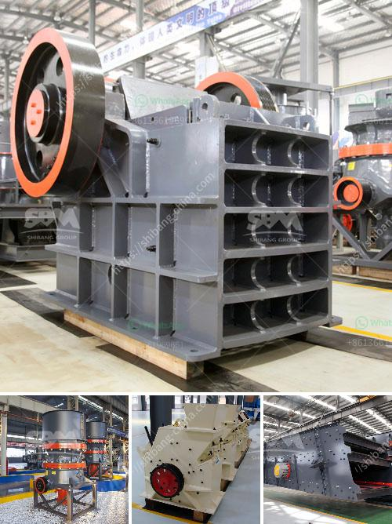

<h3>200 ton mini cement plant project cost in india</h3>
The Indian cement industry is experiencing a boom due to increased construction activities across the country. To meet the growing demand for cement, many investors are keen on setting up new cement plants in India. However, the high initial investment required for establishing a large-scale cement plant can be a major deterrent for many aspiring entrepreneurs.

In such cases, a mini cement plant becomes a viable option to consider. Typically, a mini cement plant costs between INR 200 crore to INR 500 crore. With a capacity of around 200 tons per day, the cost of a mini cement plant is significantly lower than that of a large-scale cement plant. This makes it an ideal investment opportunity for new entrepreneurs who want to enter the cement manufacturing industry.

Moreover, a mini cement plant has several other advantages over large-scale cement plants. It requires less land area, less manpower, and has lower operation and maintenance costs. Additionally, a mini cement plant can be set up in a decentralized manner, allowing for smaller plants to be established closer to the demand centers, reducing transportation costs and delivering cement faster to customers.

To minimize project costs, entrepreneurs can explore different financing options, such as bank loans, equity funding, or even government subsidies and incentives. Furthermore, partnering with experienced consultants and suppliers can help in optimizing the project cost and ensuring timely execution.

With the government's focus on infrastructure development and affordable housing, the demand for cement in India is expected to remain robust. This presents an excellent opportunity for entrepreneurs to invest in a mini cement plant and contribute to the nation's growth while earning attractive returns.

Overall, establishing a 200-ton mini cement plant in India can be a profitable venture for aspiring entrepreneurs. With lower investment requirements, smaller operational costs, and the growing demand for cement, this project has the potential to be a success. However, careful planning, detailed project evaluation, and adherence to regulatory requirements are essential to ensure a smooth and profitable operation.
<h3>Contact us</h3><ul><li><strong>Whatsapp:&nbsp;<a href="https://wa.me/8613661969651">+8613661969651</a></strong></li><li><a href="https://swt.shibang-china.com/?git&amp;zhl&amp;200 ton mini cement plant project cost in india"><strong>Online Service(chat now)</strong></a></li></ul><h3>Related</h3><ul><li><a href='mining equipment used during gold rush.md'>mining equipment used during gold rush</a></li><li><a href='used gold mining equipment for sale in south africa.md'>used gold mining equipment for sale in south africa</a></li><li><a href='stone quarry business proposal.md'>stone quarry business proposal</a></li><li><a href='stone crushet 10 tons.md'>stone crushet 10 tons</a></li><li><a href='buy stone crusher india.md'>buy stone crusher india</a></li></ul>