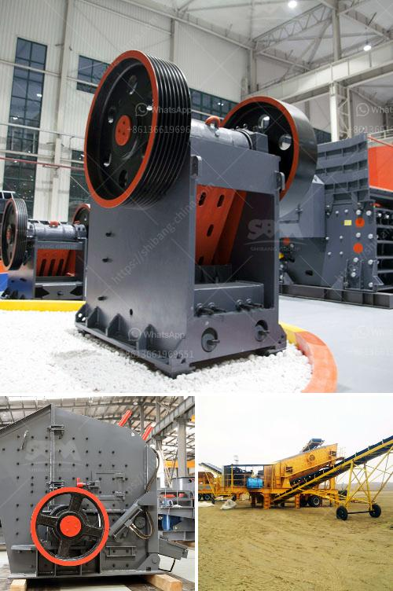

<h3>250tph complete crushing plant</h3>
The demand for construction materials is constantly increasing, and with it, the need for efficient and cost-effective crushing plants. In response to this demand, a prominent manufacturer in the industry has come up with a 250tph complete crushing plant. This state-of-the-art plant is designed to offer high productivity and reliability while ensuring minimal maintenance requirements.

At the heart of this crushing plant is a jaw crusher, which ensures a smooth and efficient operation. It is capable of crushing a variety of materials, including hard and abrasive ones. With a maximum feed size of 720mm and a range of adjustable settings, this crusher enables operators to achieve the desired product size.

To ensure a continuous flow of materials, a vibrating feeder - with a capacity of up to 500tph - is integrated into the plant. It ensures a consistent and controlled feed, preventing any interruptions in the crushing process. The feeder is equipped with pre-scalping grizzly bars, which remove any undersized or contaminated material, improving the overall efficiency.

The plant also includes a vibrating screen, which is responsible for separating the crushed materials into different sizes. This screen features multiple decks, allowing for precise classification and increased productivity. The high-frequency vibration ensures optimal screening efficiency, while the adjustable amplitude and angle can be tailored to specific application requirements.

In addition to these essential components, the complete crushing plant is equipped with a variety of conveyors. These ensure the smooth transfer of materials between various stages of the crushing process. The conveyors are designed to handle bulk materials and have adjustable speeds to match the production requirements. They are also built to withstand harsh conditions, ensuring reliability and longevity.

One of the key features of this plant is its efficient power supply. Equipped with a diesel generator, it can operate in remote areas or locations with limited access to electricity. This allows contractors to set up the plant wherever it is needed, without relying on external power sources.

Furthermore, safety is given utmost priority in the design of this crushing plant. It is equipped with multiple safety features and emergency stops, ensuring the protection of the operators and minimizing the risk of accidents. The plant’s control system is user-friendly, providing operators with a clear overview of the process and allowing them to monitor and control operations with ease.

Overall, the 250tph complete crushing plant is designed to offer a solution for contractors seeking a versatile and efficient plant for their crushing needs. With its robust construction, high productivity, and minimal maintenance requirements, it is sure to meet the ever-growing demands of the industry. Whether it is used in quarrying, mining, or recycling applications, this plant is poised to deliver exceptional performance and reliability to its operators.
<h3>Contact us</h3><ul><li><strong>Whatsapp:&nbsp;<a href="https://wa.me/8613661969651">+8613661969651</a></strong></li><li><a href="https://swt.shibang-china.com/?git&amp;zhl&amp;250tph complete crushing plant"><strong>Online Service(chat now)</strong></a></li></ul><h3>Related</h3><ul><li><a href='density of balls for mills.md'>density of balls for mills</a></li><li><a href='how to build a stone crusher.md'>how to build a stone crusher</a></li><li><a href='mill grinding machines for sale.md'>mill grinding machines for sale</a></li><li><a href='part of ball mills.md'>part of ball mills</a></li><li><a href='sand wash plant 50tph.md'>sand wash plant 50tph</a></li></ul>