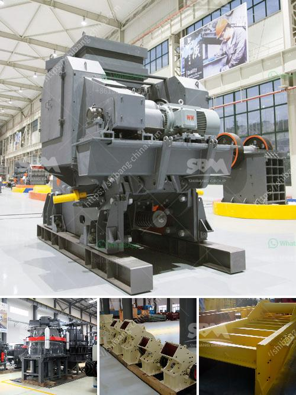

<h3>2d model ball mill</h3>
The 2D model ball mill is a type of grinding machine designed to assist in grinding and mixing various materials to create a homogeneous and efficient dispersion of solids in liquids. It consists of a rotating drum filled with cylindrical grinding media, such as steel balls, and a stationary chamber that holds the liquid material to be milled.

One of the key advantages of the 2D model ball mill is its ability to generate a uniform particle size distribution in the final product. This is achieved through the use of a specific number and configuration of grinding media, as well as the rotation speed and direction of the drum. As the drum rotates, the grinding media cascade and tumble, impacting the particles in the liquid and reducing their size through a combination of mechanical forces and attrition.

In addition to particle size reduction, the 2D model ball mill can also facilitate the mixing and blending of different materials. By varying the time and intensity of the milling process, it is possible to achieve a thorough dispersion of solids in the liquid phase, resulting in improved product quality and performance.

The 2D model ball mill finds wide application across various industries, including pharmaceuticals, chemicals, cosmetics, and food processing. In the pharmaceutical industry, for example, it is used to pulverize active pharmaceutical ingredients (APIs) and excipients, ensuring a uniform and fine particle size distribution for better drug performance. Similarly, in the food industry, the ball mill is employed for grinding and homogenizing ingredients such as cocoa, sugar, and milk powders, resulting in consistent and smooth products.

The 2D model ball mill operates on the principle of shear and impact forces between the grinding media and the material being milled. The grinding media continuously collide and rub against the particles, effectively breaking them down into smaller sizes. The design and selection of the grinding media are crucial to achieving the desired milling performance. Factors such as media size, composition, and density can greatly influence the milling efficiency and the final product quality.

Although the 2D model ball mill offers several advantages, it is important to note some limitations associated with its use. The main drawback is its relatively low throughput compared to larger-scale milling equipment. This means that larger quantities of material may require multiple batches or longer milling times to achieve the desired results. Additionally, the milling process may generate heat, affecting the stability and quality of temperature-sensitive materials.

In conclusion, the 2D model ball mill is a versatile grinding and mixing machine that offers excellent control over particle size distribution and dispersion. Its applications span various industries and can significantly improve the performance and quality of processed materials. However, it is essential to carefully consider the specific requirements and limitations of the 2D model ball mill when choosing a milling solution for a particular application.
<h3>Contact us</h3><ul><li><strong>Whatsapp:&nbsp;<a href="https://wa.me/8613661969651">+8613661969651</a></strong></li><li><a href="https://swt.shibang-china.com/?git&amp;zhl&amp;2d model ball mill"><strong>Online Service(chat now)</strong></a></li></ul><h3>Related</h3><ul><li><a href='small portable concrete crusher.md'>small portable concrete crusher</a></li><li><a href='italia crusher machine.md'>italia crusher machine</a></li><li><a href='conveyor belt manufacturers in kolkata.md'>conveyor belt manufacturers in kolkata</a></li><li><a href='sand wash plant for sale.md'>sand wash plant for sale</a></li><li><a href='crusher and screening plants for sale.md'>crusher and screening plants for sale</a></li></ul>