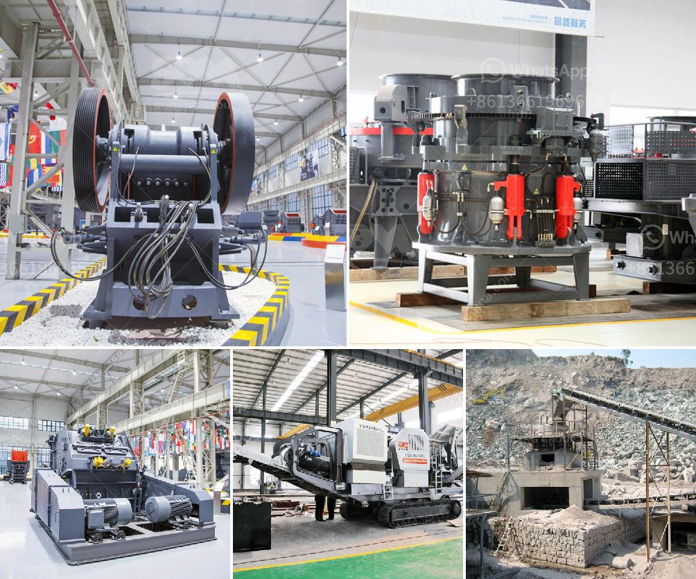

<h3>3 roller raymond mill india</h3>
The three-roller Raymond mill is a grinding equipment that is widely used in many industries such as cement, chemical industry, mining, and others. It is suitable for processing various non-flammable and explosive materials with Mohs hardness below 9.3 and humidity below 6%.

One of the main advantages of the three-roller Raymond mill is its high efficiency and low power consumption. Compared to traditional grinding mills, this mill can increase production by more than 40% and save electricity consumption by more than 30%. This is mainly due to the unique design of the grinding roller and grinding ring. The materials are evenly distributed on the grinding roller and grinding ring, which effectively improve the grinding efficiency.

Another advantage of the three-roller Raymond mill is its wide range of applications. It can grind various materials, from limestone to talc, from barite to dolomite, from marble to gypsum, and more. This versatility makes it widely used in the production of chemical, metallurgical, and building materials. Its final product size can be adjusted between 30-400 mesh, allowing for a wide range of particle sizes to meet different requirements.

Additionally, the three-roller Raymond mill has a compact structure and occupies a small footprint. It is easy to install, operate, and maintain, making it popular among mill manufacturers and users. The machine is equipped with a dust removal system, which effectively reduces dust pollution during operation, creating a better working environment.

India is a country with rich mineral resources. Many industries require a reliable and efficient grinding mill, and the three-roller Raymond mill is an ideal choice. It is widely used in the processing of various ores, such as limestone, calcite, granite, gypsum, marble, dolomite, and others. The Indian market has a huge demand for these materials, and the three-roller Raymond mill can effectively meet this demand.

In recent years, with the rapid development of India's infrastructure construction, the demand for high-quality building materials has increased significantly. The three-roller Raymond mill with its excellent performance and superior advantages has gradually gained popularity in the Indian market. It not only meets the needs of the construction industry but also contributes to the economic development of the country.

In conclusion, the three-roller Raymond mill is a versatile and efficient grinding equipment that has a wide range of applications in India. Its high grinding efficiency, low power consumption, and compact structure make it an ideal choice for many industries. With the continuous upgrading and improvement, the three-roller Raymond mill will surely bring more benefits and contribute to India's economic development.
<h3>Contact us</h3><ul><li><strong>Whatsapp:&nbsp;<a href="https://wa.me/8613661969651">+8613661969651</a></strong></li><li><a href="https://swt.shibang-china.com/?git&amp;zhl&amp;3 roller raymond mill india"><strong>Online Service(chat now)</strong></a></li></ul><h3>Related</h3><ul><li><a href='roll wheel pulverizer.md'>roll wheel pulverizer</a></li><li><a href='crushed stone plant peru.md'>crushed stone plant peru</a></li><li><a href='jaw crusher vs gyratory crusher stone crusher quarry.md'>jaw crusher vs gyratory crusher stone crusher quarry</a></li><li><a href='granite machine concrete.md'>granite machine concrete</a></li><li><a href='types of crushing machine.md'>types of crushing machine</a></li></ul>