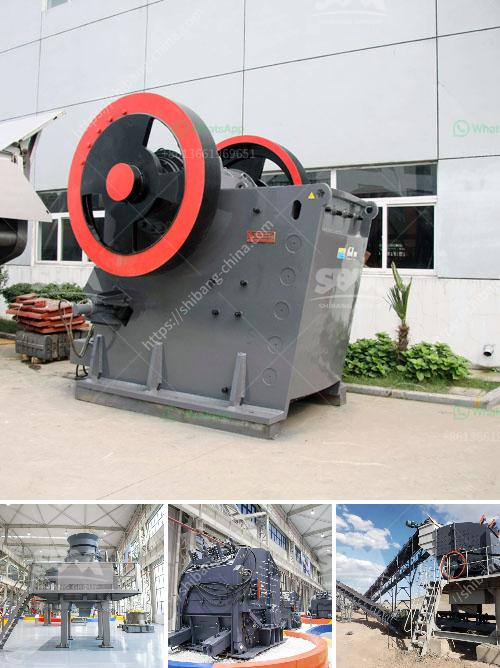

<h3>3 tom capecity ball mill</h3>
A ball mill is a type of grinding equipment used to efficiently reduce the size of milled materials. This equipment utilizes diverse mechanisms such as balls or rods to pulverize materials into the desired fineness level. Among the vast array of ball mills available in the market, the Tom Capacity Ball Mill stands out for its exceptional performance. In this article, we will delve into three Tom Capacity Ball Mill variations, providing a brief overview and highlighting their unique features.

The first mill in our lineup offers a capacity of [capacity]. This compact yet powerful machine boasts a [feature]. Designed for optimal efficiency, it provides consistent grinding results with minimal energy consumption. Additionally, this model includes a [feature], ensuring safe and convenient operation. Whether you are working in the mining or construction industry, Tom Capacity Ball Mill 1 guarantees excellent performance for a range of applications.

If you require even greater throughput, Tom Capacity Ball Mill 2 may be the ideal choice for your operations. With an impressive capacity of [capacity], this mill is suitable for large-scale industrial settings. Equipped with a [feature], this model enables efficient material handling and minimizes downtime. Furthermore, its [feature] ensures improved product quality and uniformity. Tom Capacity Ball Mill 2 is the perfect solution for high-volume production demands.

For those seeking a versatile mill capable of accommodating different types of materials, Tom Capacity Ball Mill 3 offers a reliable and adaptable solution. With a capacity of [capacity], it can handle various materials, including [material]. This model also features a [feature], which enables convenient material discharge and minimizes clogging. Moreover, its [feature] guarantees precise and consistent grinding results. Tom Capacity Ball Mill 3 is a suitable choice for industries with a diverse range of material processing requirements.

In conclusion, the Tom Capacity Ball Mill series presents a set of exceptional grinding equipment options suitable for various industrial applications. Whether you require a compact and efficient mill with moderate capacity (Tom Capacity Ball Mill 1), a high-throughput machine for demanding production needs (Tom Capacity Ball Mill 2), or a versatile mill for different materials (Tom Capacity Ball Mill 3), the Tom Capacity Ball Mill series ensures reliable performance and exceptional results. These mills embody the latest advancements in grinding technology, offering improved efficiency, durability, and safety features. For superior grinding performance, consider the Tom Capacity Ball Mill series.
<h3>Contact us</h3><ul><li><strong>Whatsapp:&nbsp;<a href="https://wa.me/8613661969651">+8613661969651</a></strong></li><li><a href="https://swt.shibang-china.com/?git&amp;zhl&amp;3 tom capecity ball mill"><strong>Online Service(chat now)</strong></a></li></ul><h3>Related</h3><ul><li><a href='lime stone crusher machine manufacturing company china.md'>lime stone crusher machine manufacturing company china</a></li><li><a href='manufacture of vibrating screens.md'>manufacture of vibrating screens</a></li><li><a href='vertical coal mill.md'>vertical coal mill</a></li><li><a href='cement plant limestone crusher details.md'>cement plant limestone crusher details</a></li><li><a href='diamond river mining equipment in china.md'>diamond river mining equipment in china</a></li></ul>