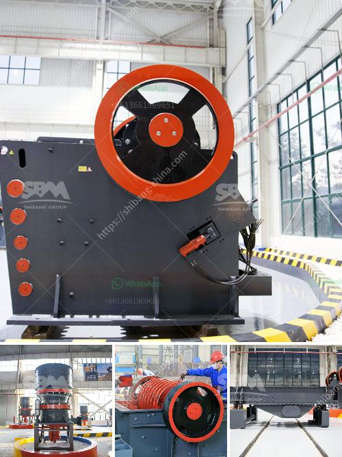

<h3>300kg to 500kg ball mill</h3>
A ball mill is a type of grinder used to grind materials into extremely fine powder for use in mineral dressing processes, paints, pyrotechnics, ceramics, and selective laser sintering. With its wide range of applications, ball mills are ideal for grinding materials of various hardness and particle size ranges.

One common type of ball mill is the horizontal cylindrical grinding mill. This mill grinds and mixes various materials into fine powder using rotating barrels. The size of the barrels can vary between 300kg to 500kg, making it suitable for small-scale production or laboratory use.

The ball mill consists of a hollow cylindrical shell that rotates on its axis. Inside the shell, there are grinding media - steel balls or ceramic balls - that crush the material as the barrel rotates. The material is fed into the mill through a hollow trunnion at the rear, and the ground product is discharged through similar openings at the front.

The main advantages of a ball mill include its simple structure, ease of operation, and low maintenance requirements. The grinding media and materials are constantly impacted and ground, resulting in high grinding efficiency. Additionally, the ball mill can grind various types of materials, including dry or wet grinding, for diverse applications.

Ball mills are commonly used in the mining industry, where they are essential for grinding ores to generate valuable minerals. They are also widely used in the ceramic and chemical industries for blending, mixing, and particle size reduction of various materials.

In conclusion, the 300kg to 500kg ball mill is a versatile and efficient tool for grinding and blending materials. Its compact size and low maintenance make it suitable for a variety of applications, from small-scale production to laboratory use. Whether used in mining, ceramics, or chemicals, the ball mill offers high grinding efficiency and reliable performance.
<h3>Contact us</h3><ul><li><strong>Whatsapp:&nbsp;<a href="https://wa.me/8613661969651">+8613661969651</a></strong></li><li><a href="https://swt.shibang-china.com/?git&amp;zhl&amp;300kg to 500kg ball mill"><strong>Online Service(chat now)</strong></a></li></ul><h3>Related</h3><ul><li><a href='how to pulverized limestone crusher.md'>how to pulverized limestone crusher</a></li><li><a href='kohinoor stone crusher contact.md'>kohinoor stone crusher contact</a></li><li><a href='stone crushing equipment price in nigeria.md'>stone crushing equipment price in nigeria</a></li><li><a href='how much is a gold crusher in kenya.md'>how much is a gold crusher in kenya</a></li><li><a href='granite quarry machines.md'>granite quarry machines</a></li></ul>