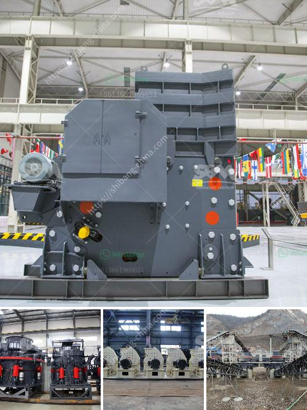

<h3>300ton per hour stone crusher</h3>
The stone crusher is a piece of indispensable equipment for the stone crushing line. Our crushers are available in a variety of models, including hot-selling models: PE-500*750, PE-600*900, PE-1000*1200 and more. 

What makes our crushers outstanding in the market is their extraordinary performance. We produce our crushers with strict quality control, ensuring that they are strong and durable. With a crushing capacity of up to 300 tons per hour, our crushers can easily break down various materials, such as rocks, granite, limestone, concrete, and much more. 

Our stone crushers are equipped with a high-quality electric motor that helps to establish a smooth and steady performance. The energy-saving design ensures low power consumption, resulting in cost-effective crushing operations. The overall structure is compact and lightweight, facilitating easy transportation and installation. 

In addition to the powerful crushing capacity, our stone crushers are also equipped with advanced hydraulic technology. This enables the crushers to adjust their settings according to different materials and desired end products. Whether you require fine or coarse crushing, our machines will deliver optimal results. 

Furthermore, we offer a comprehensive aftersales service to ensure customer satisfaction. Our technical team is always available to provide on-site assistance and training. We also provide spare parts for our stone crushers, guaranteeing smooth and uninterrupted production. 

If you are in need of a high-quality stone crusher machine that can process up to 300 tons of material per hour, look no further. Our crushers are reliable, efficient, and built to last. Contact us today to learn more about our products and services.
<h3>Contact us</h3><ul><li><strong>Whatsapp:&nbsp;<a href="https://wa.me/8613661969651">+8613661969651</a></strong></li><li><a href="https://swt.shibang-china.com/?git&amp;zhl&amp;300ton per hour stone crusher"><strong>Online Service(chat now)</strong></a></li></ul><h3>Related</h3><ul><li><a href='used equipment cement for sale vertical roller mills.md'>used equipment cement for sale vertical roller mills</a></li><li><a href='ball mill cement plant.md'>ball mill cement plant</a></li><li><a href='5 ton per hour mobile gold process mill.md'>5 ton per hour mobile gold process mill</a></li><li><a href='prices of copper smelting plant.md'>prices of copper smelting plant</a></li><li><a href='vsi crusher price.md'>vsi crusher price</a></li></ul>