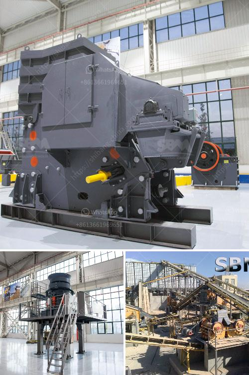

<h3>4 roller mill nigeria</h3>
The 4-roller mill in Nigeria is one of the key machines used for flour milling. It is commonly used in medium to large-scale industries and has a capacity ranging from 300 to 500 tons per day. This mill is widely appreciated for its efficiency in separating the endosperm from the bran, thus producing high-quality flour.

The 4-roller mill consists of four horizontally placed rollers that rotate at the same speed but in opposite directions. Each roller has a different function and works harmoniously to produce consistent and uniform flour. The first roller, known as the break roller, applies a significant amount of pressure to break the wheat kernels into smaller pieces. This process is essential for separating the bran from the endosperm.

After the break roller, the process continues with the reduction roller, which further reduces the size of the wheat particles. The main goal of this roller is to extract the endosperm, which is the starchy part of the kernel that contains the highest concentration of proteins and nutrients.

The subsequent roller is called the sizing roller. It uses sieves to separate the endosperm particles of different sizes, ensuring a uniform particle distribution. This step is crucial for producing a consistent quality of flour.

The final roller, known as the purification or bran finisher roller, is responsible for removing any remaining bran particles from the flour. This step is crucial for producing high-quality flour with a low bran content.

One of the advantages of using the 4-roller mill in Nigeria is its high capacity. With a throughput ranging from 300 to 500 tons per day, this mill can handle large quantities of wheat, making it suitable for medium to large-scale milling operations. Additionally, it offers excellent flour extraction rates, ensuring efficient utilization of the wheat kernels.

The 4-roller mill also stands out for its versatility and adaptability. It can easily adjust to different wheat varieties, allowing millers to produce different types of flour based on market demands. This flexibility is particularly important in Nigeria, where different types of flours, such as bread flour, semolina, and special-purpose flours, are in high demand.

Furthermore, the 4-roller mill is known for its energy efficiency. Thanks to its advanced design and technology, this mill consumes less energy compared to older milling machines, contributing to cost savings for mill operators.

In conclusion, the 4-roller mill plays a crucial role in Nigeria's flour milling industry. With its high capacity, efficient separation of endosperm from bran, and versatility in producing various types of flour, this machine offers numerous benefits to millers. Its energy efficiency and ability to handle large quantities of wheat make it a valuable asset for medium to large-scale milling operations.
<h3>Contact us</h3><ul><li><strong>Whatsapp:&nbsp;<a href="https://wa.me/8613661969651">+8613661969651</a></strong></li><li><a href="https://swt.shibang-china.com/?git&amp;zhl&amp;4 roller mill nigeria"><strong>Online Service(chat now)</strong></a></li></ul><h3>Related</h3><ul><li><a href='mobile crusher machine manufacturer.md'>mobile crusher machine manufacturer</a></li><li><a href='automatic rolling mill manufacturer liberia.md'>automatic rolling mill manufacturer liberia</a></li><li><a href='mobile crushing price.md'>mobile crushing price</a></li><li><a href='bauxite crusher design.md'>bauxite crusher design</a></li><li><a href='stone crushers supply.md'>stone crushers supply</a></li></ul>