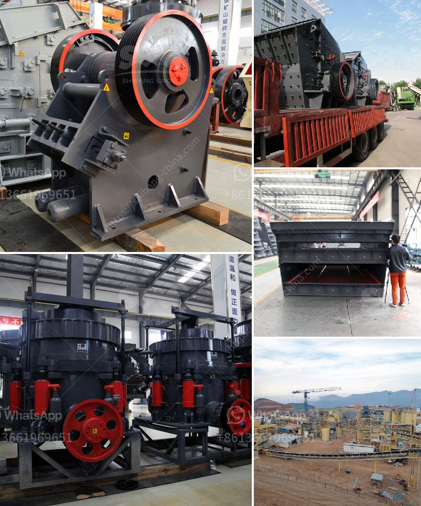

<h3>450 tph limestone crusher</h3>
The limestone crusher is a piece of equipment that can help you in many ways and it guarantees the desired crushing efficiency. However, you need to ensure that it is a high-quality machine of the appropriate size for your needs. With this in mind, a 450 TPH limestone crusher is one such machine that meets the requirements for any crushing project.

Limestone is a sedimentary rock that is mainly composed of calcium carbonate. It is widely used in various industries, including construction, agriculture, and even household applications. In order to obtain the desired size and shape, limestone needs to be crushed and screened. This is where the limestone crusher comes into play.

With a crushing capacity of 450 TPH (which stands for tons per hour), this machine can effectively process limestone for various projects. Whether you need to crush a small or large amount of limestone, you can count on this crusher to get the job done. It is capable of handling rocks of various sizes, ensuring that you obtain the desired end product.

One of the main advantages of this limestone crusher is its high crushing efficiency. The machine is designed to reduce large rocks into smaller pieces and produce uniform-sized aggregates. With its powerful motor and sturdy construction, it can process a significant amount of limestone in a short period of time. This enhances productivity and reduces the overall cost of your project.

Additionally, the 450 TPH limestone crusher is equipped with various features that make it user-friendly. It comes with a user-friendly control panel that allows operators to adjust the settings and optimize the performance of the machine. The crusher also has safety features to ensure that accidents are minimized during operation.

Furthermore, this limestone crusher is designed to be mobile, making it convenient for transport from one site to another. It can be quickly set up and dismantled, allowing for easy relocation. This flexibility is particularly useful for contractors who need to move the crusher from one project site to another.

In conclusion, a 450 TPH limestone crusher is a dependable machine that can provide superior performance for your crushing needs. It is a versatile and efficient machine that is suitable for various projects. Whether you are a construction company, a mining operation, or a homeowner looking for limestone for your garden, this crusher can help you achieve your goals. With its high crushing capacity, user-friendly controls, and mobility, you can rely on this machine to deliver the desired results.
<h3>Contact us</h3><ul><li><strong>Whatsapp:&nbsp;<a href="https://wa.me/8613661969651">+8613661969651</a></strong></li><li><a href="https://swt.shibang-china.com/?git&amp;zhl&amp;450 tph limestone crusher"><strong>Online Service(chat now)</strong></a></li></ul><h3>Related</h3><ul><li><a href='crusher plant made in pakistan price.md'>crusher plant made in pakistan price</a></li><li><a href='mobile mini crusher hire.md'>mobile mini crusher hire</a></li><li><a href='how to acid washing silica sand.md'>how to acid washing silica sand</a></li><li><a href='prices for stone crusher plant.md'>prices for stone crusher plant</a></li><li><a href='turkey quarry machines manufacturer.md'>turkey quarry machines manufacturer</a></li></ul>