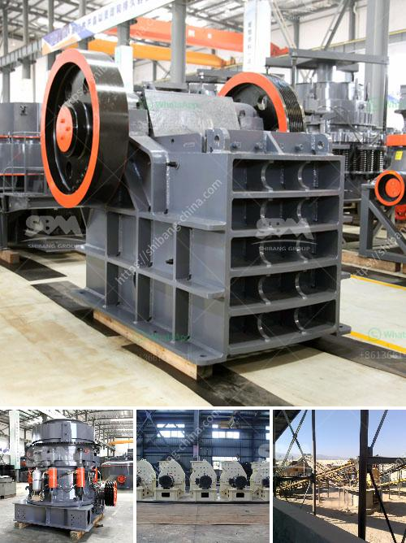

<h3>5 ton per hour mobile gold process mill</h3>
The mining industry can be a challenging and unpredictable sector, especially when it comes to extracting precious metals such as gold. In order to efficiently process the materials and extract gold, it is necessary to have the right equipment. One such equipment that is commonly used in mining operations is the 5-ton per hour mobile gold process mill.

The 5-ton per hour mobile gold process mill offers a unique and efficient solution for onsite processing of gold ore. It enables the mining operators to take their ore directly to the facility, reducing the need for costly transportation and ensuring that the extracted gold is captured instantly.

This mobile process mill is specially designed to ensure maximum efficiency, productivity, and safety. It is equipped with advanced features and technology that allow for the processing of large volumes of ore within a short period. The process mill incorporates various stages of crushing, grinding, and leaching, which are crucial in the extraction of gold from the ore.

What sets this mobile gold process mill apart from traditional mills is its mobility. It can be easily moved to different mining sites, providing flexibility and convenience for mining operations. This mobility also eliminates the need for permanent infrastructure, reducing costs and environmental impact.

Additionally, the 5-ton per hour mobile gold process mill is designed to operate with minimal human intervention. It is equipped with an automatic control system that ensures optimal operation and production. This feature not only improves efficiency but also enhances safety by reducing the risk of human error.

In conclusion, the 5-ton per hour mobile gold process mill is an essential tool for mining operators in their quest to extract gold efficiently and profitably. Its mobility, efficiency, and advanced features make it a valuable asset in the mining industry. With this process mill, mining operators can maximize their gold extraction while minimizing costs and environmental impact.
<h3>Contact us</h3><ul><li><strong>Whatsapp:&nbsp;<a href="https://wa.me/8613661969651">+8613661969651</a></strong></li><li><a href="https://swt.shibang-china.com/?git&amp;zhl&amp;5 ton per hour mobile gold process mill"><strong>Online Service(chat now)</strong></a></li></ul><h3>Related</h3><ul><li><a href='ball mill manufacturer in india.md'>ball mill manufacturer in india</a></li><li><a href='nigeria c125 jaw crusher.md'>nigeria c125 jaw crusher</a></li><li><a href='300kg to 500kg ball mill.md'>300kg to 500kg ball mill</a></li><li><a href='rock crushing machines.md'>rock crushing machines</a></li><li><a href='ball mill forge price.md'>ball mill forge price</a></li></ul>