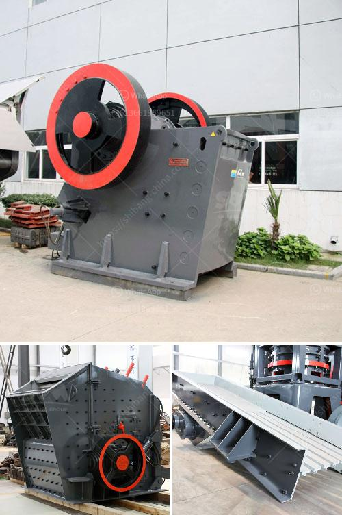

<h3>500 ton hour coal crusher and screen</h3>
Coal is the backbone of electricity generation worldwide, accounting for approximately 40% of global electricity production. In order to meet the growing demand for electricity, large-scale coal-fired power plants are being built around the world. These power plants require a large amount of coal to be processed, and hence the need for efficient and reliable coal crushers.

A 500 ton/hour coal crusher and screen is essential for coal processing. With a capacity of 500 tons per hour, this crusher and screen can handle a range of materials such as coal, limestone, and gypsum. It was designed and manufactured to be professional, safe, and reliable.

The crusher is equipped with a heavy-duty jaw crusher, a vibrating grizzly feeder, and an integrated pre-screen system. The pre-screen can bypass fines, allowing for higher crushing capacities while reducing the wear on the crusher. This results in increased productivity and reduced downtime.

The screen, on the other hand, classifies the crushed coal into different sizes, allowing for the separation of fine coal and coarse coal. The screen is designed for efficient screening and can handle large volumes of coal. It is equipped with high-quality screening media that can withstand the abrasive nature of coal.

Overall, a 500 ton/hour coal crusher and screen is an essential piece of equipment for coal processing. It is ideal for large-scale coal-fired power plants and coal mining operations. It ensures maximum productivity, reliability, and safety in the coal processing industry. With the growing demand for electricity and the reliance on coal, investing in a reliable coal crusher and screen is crucial for the smooth operation of power plants and mining facilities.
<h3>Contact us</h3><ul><li><strong>Whatsapp:&nbsp;<a href="https://wa.me/8613661969651">+8613661969651</a></strong></li><li><a href="https://swt.shibang-china.com/?git&amp;zhl&amp;500 ton hour coal crusher and screen"><strong>Online Service(chat now)</strong></a></li></ul><h3>Related</h3><ul><li><a href='portable gold ore crusher.md'>portable gold ore crusher</a></li><li><a href='100tpd cement plant cost in india.md'>100tpd cement plant cost in india</a></li><li><a href='rock cutting and grinding machine price.md'>rock cutting and grinding machine price</a></li><li><a href='clay graphite grinding process.md'>clay graphite grinding process</a></li><li><a href='gypsum production plant.md'>gypsum production plant</a></li></ul>