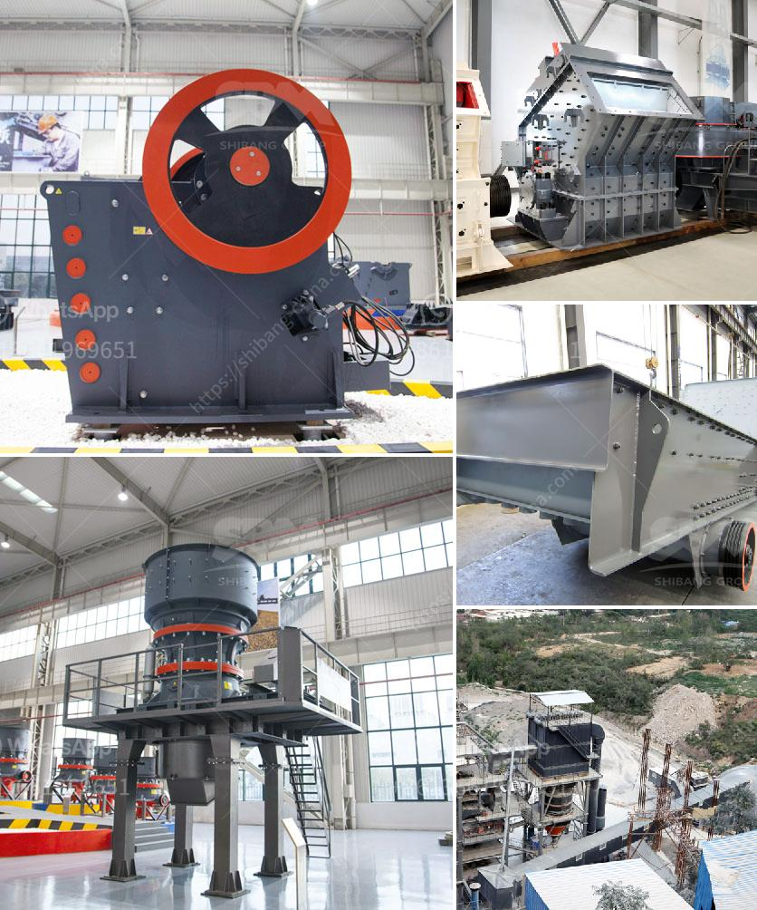

<h3>500 tone gypsum powder manufacture pant</h3>
A 500-ton gypsum powder manufacturing plant is a significant investment for any company, but one that can lead to significant profits if done correctly. Gypsum powder has a wide range of applications, including construction, agriculture, and manufacturing, making it a valuable commodity in the market.

The first step in setting up a gypsum powder manufacturing plant is finding the right location. The plant requires a large area of land, preferably close to a gypsum mine to minimize transportation costs. The location should also have access to a steady source of water and power supply.

Once the location is secured, the next step is to design and construct the plant. The plant should have a production capacity of 500 tons per day to ensure profitability. The layout of the plant should be optimized to facilitate the movement of materials and efficient workflow.

One of the most crucial components of the plant is the gypsum grinding mill. This machine grinds the gypsum rock into a fine powder, which is then used in various applications. The grinding mill should be equipped with advanced technology to ensure high productivity and quality of the final product.

To produce high-quality gypsum powder, it is essential to control the moisture content in the gypsum rock. This can be achieved by using a dryer system, which removes the excess moisture and ensures the gypsum rock is suitable for grinding. The dryer system should be energy-efficient to minimize operating costs.

After the grinding process, the gypsum powder needs to be sorted and packaged. This can be done through an automated packing system that ensures accuracy and efficiency. The packaging should be sturdy to prevent any damage to the gypsum powder during transportation.

To operate the plant efficiently, it is vital to have a skilled workforce who can manage the production process effectively. The employees should be trained in operating the machinery, maintaining the equipment, and ensuring safety protocols are followed. Regular maintenance of the machinery is crucial to prevent any downtime and ensure continuous production.

Marketing and distribution are also critical aspects of running a gypsum powder manufacturing plant. The company should establish strong relationships with distributors and customers to ensure a steady demand for the product. Exploring new markets and identifying potential customers should be an ongoing effort.

Investing in a 500-ton gypsum powder manufacturing plant is a long-term commitment that requires careful planning and execution. However, with the right location, efficient machinery, skilled workforce, and effective marketing strategies, the plant can be a profitable venture. Gypsum powder has a wide range of applications, and its demand is expected to continue growing, making this investment a promising opportunity for companies in the industry.
<h3>Contact us</h3><ul><li><strong>Whatsapp:&nbsp;<a href="https://wa.me/8613661969651">+8613661969651</a></strong></li><li><a href="https://swt.shibang-china.com/?git&amp;zhl&amp;500 tone gypsum powder manufacture pant"><strong>Online Service(chat now)</strong></a></li></ul><h3>Related</h3><ul><li><a href='cement vertical mill tph kenya.md'>cement vertical mill tph kenya</a></li><li><a href='bentonite grinding machine manufacturer in india.md'>bentonite grinding machine manufacturer in india</a></li><li><a href='metal conveyor belts in plates.md'>metal conveyor belts in plates</a></li><li><a href='vibrating screens manufacturer south africa.md'>vibrating screens manufacturer south africa</a></li><li><a href='hammer mill dimension for 15tph.md'>hammer mill dimension for 15tph</a></li></ul>