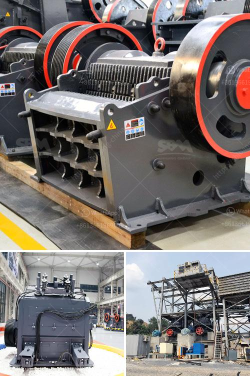

<h3>5hp industrial crusher mill</h3>
In today's fast-paced industrial world, the demand for efficient and reliable machinery is unparalleled. One such equipment that has revolutionized various industries is the 5HP industrial crusher mill. This powerhouse machine has become an essential component across numerous manufacturing sectors due to its impressive capabilities and versatile features. In this article, we will explore the exceptional benefits and applications of a 5HP industrial crusher mill.

The 5HP industrial crusher mill is designed to provide a high level of power, allowing it to tackle even the toughest materials. Equipped with a robust motor, it delivers exceptional crushing capacity that ensures a rapid and efficient processing of various materials. From grinding grains and agricultural products to pulverizing solid minerals, this machine can effortlessly handle an extensive range of applications.

The versatility of the 5HP industrial crusher mill is truly impressive. It finds application in diverse industries, including agriculture, mining, construction, pharmaceuticals, and food processing. From milling grains for animal feed to pulverizing minerals for mineral processing, it has proven to be a reliable workhorse, meeting the unique demands of each industry it serves.

One of the primary functions of the 5HP industrial crusher mill is size reduction, making it an indispensable machine in the manufacturing process. By efficiently reducing the size of materials, it helps enhance the overall quality and consistency of the final product. Whether it is reducing the size of minerals to extract valuable elements or achieving the perfect particle size for food processing, this machine excels at bringing materials to the desired specifications.

The 5HP industrial crusher mill is crafted from top-quality materials, ensuring excellent durability and longevity. Its robust construction, combined with advanced engineering, guarantees longevity even in the toughest working conditions. With regular maintenance and care, this machine can deliver years of trouble-free performance, making it a wise long-term investment for business owners.

Safety is of utmost importance in any industrial setting. The 5HP industrial crusher mill is designed to prioritize operator safety. It incorporates various safety features, such as automatic shut-off mechanisms and emergency stop buttons, to safeguard workers during operation. These fail-safe features significantly reduce the risk of accidents, promoting a safer and more productive work environment.

In conclusion, the 5HP industrial crusher mill stands as a true powerhouse within the manufacturing world. Its outstanding features, versatility, and reliability make it an indispensable machine in various industries. From size reduction to efficient processing, this industrial crusher mill streamlines operations while ensuring high-quality outputs. As technology advances, it is inevitable that this indispensable machinery will continue to evolve, opening new possibilities for improved productivity in the future.
<h3>Contact us</h3><ul><li><strong>Whatsapp:&nbsp;<a href="https://wa.me/8613661969651">+8613661969651</a></strong></li><li><a href="https://swt.shibang-china.com/?git&amp;zhl&amp;5hp industrial crusher mill"><strong>Online Service(chat now)</strong></a></li></ul><h3>Related</h3><ul><li><a href='talc grinding machine manufacturer from uzbekistan.md'>talc grinding machine manufacturer from uzbekistan</a></li><li><a href='balls for ball mill.md'>balls for ball mill</a></li><li><a href='hydraulic cone crusher price.md'>hydraulic cone crusher price</a></li><li><a href='limestone making size.md'>limestone making size</a></li><li><a href='crasher sand machine south africa.md'>crasher sand machine south africa</a></li></ul>