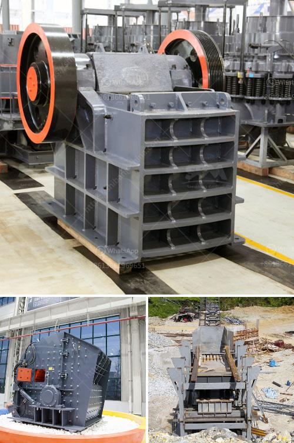

<h3>65 tph cone crusher complete plant</h3>
The cone crusher is widely used in fields such as metal and non-metal mines, cement plants, construction, sand and gravel metallurgy, and other industries. It can process iron ore, copper ore, gold ore, manganese ore, river stone, gravel, granite, basalt, minerals, quartz, diabase, etc. It is a typical secondary crushing equipment which is mainly used for medium-sized materials crushing.

The 65 tph cone crusher complete plant includes vibrating feeder GZD750*2500, jaw crusher PE500*750, cone crusher PYB900, vibrating screen 3YZS1548, belt conveyor and centrally electric controlling system, etc. The designed capacity is from 40t/h to 65t/h. To meet customer’s specific requirement, we can also add other equipments such as impact crusher, dust catcher on the plant.

The cone crusher is equipped with multiple cavity types, which can meet the different crushing requirements of various materials. It has large crushing ratio and high production efficiency. The hydraulic system can quickly adjust the size of the discharge port and clear the crushing chamber, greatly reducing downtime.

The vibrating feeder and vibrating screen are both key equipment for accurate feeding and screening. The vibrating feeder ensures that the materials are evenly fed into the jaw crusher, while the vibrating screen separates the crushed stones into different sizes.

The belt conveyor is responsible for transporting the materials between different processing stages, ensuring efficient and smooth operation of the whole plant.

Overall, the 65 tph cone crusher complete plant is a reliable and efficient equipment for medium-sized and fine crushing operations. It is ideal for processing materials with high hardness and large size. With its advanced technology and reliable performance, it can meet the diverse needs of customers and help them achieve high productivity and profitability.
<h3>Contact us</h3><ul><li><strong>Whatsapp:&nbsp;<a href="https://wa.me/8613661969651">+8613661969651</a></strong></li><li><a href="https://swt.shibang-china.com/?git&amp;zhl&amp;65 tph cone crusher complete plant"><strong>Online Service(chat now)</strong></a></li></ul><h3>Related</h3><ul><li><a href='stone crusher company india mastro.md'>stone crusher company india mastro</a></li><li><a href='jaw crusher 600x900 indonesia.md'>jaw crusher 600x900 indonesia</a></li><li><a href='crusher stone price south africa.md'>crusher stone price south africa</a></li><li><a href='talc raymond grinding mill.md'>talc raymond grinding mill</a></li><li><a href='manufacturing equipments of lime stone milling.md'>manufacturing equipments of lime stone milling</a></li></ul>