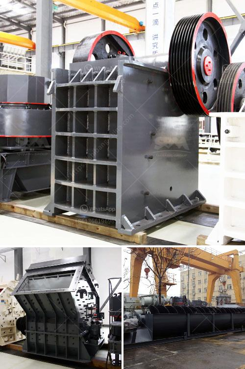

<h3>about aggregate crusher plants</h3>
Aggregate crusher plants are crucial to the construction industry, as they provide the basic materials required for making concrete, asphalt, and roadways. The process of aggregate crushing involves delivering the raw materials to the crusher, where they are crushed into smaller pieces. These pieces are then screened and classified into different sizes according to their specific application.

One of the primary advantages of aggregate crusher plants is their ability to produce a wide range of sizes and shapes of aggregate material. This versatility allows construction companies to cater to different project requirements, whether it is building a road, a bridge, or a high-rise building. With the ability to produce various sizes of aggregate, these plants ensure that the specific needs of the project are met.

Furthermore, aggregate crusher plants help to conserve natural resources. By recycling construction waste and reducing the need for new aggregate mining, these plants promote a more sustainable approach to construction. This not only reduces the environmental impact but also saves energy and reduces transportation costs.

In addition, aggregate crusher plants facilitate easier and more efficient construction. The availability of a steady supply of quality aggregate materials ensures that construction projects can progress smoothly, with minimal delays and interruptions. This leads to shorter construction times, higher project efficiencies, and ultimately lower costs.

Lastly, aggregate crusher plants play a vital role in the local economy. These plants create job opportunities for local communities, stimulating economic growth and development. From the transportation of raw materials to operating the crushers and screening equipment, various employment opportunities are created throughout the entire process.

In conclusion, aggregate crusher plants are essential in the construction industry. They provide the basic materials required for building infrastructure, while promoting sustainability and boosting the local economy. By understanding their importance, construction companies can ensure that they invest in reliable, efficient, and environmentally-friendly aggregate crusher plants.
<h3>Contact us</h3><ul><li><strong>Whatsapp:&nbsp;<a href="https://wa.me/8613661969651">+8613661969651</a></strong></li><li><a href="https://swt.shibang-china.com/?git&amp;zhl&amp;about aggregate crusher plants"><strong>Online Service(chat now)</strong></a></li></ul><h3>Related</h3><ul><li><a href='rent stone crusher in gresik.md'>rent stone crusher in gresik</a></li><li><a href='sand manufacturing machine.md'>sand manufacturing machine</a></li><li><a href='cone crusher for sale philippines.md'>cone crusher for sale philippines</a></li><li><a href='jaw crusher in dar es salaam.md'>jaw crusher in dar es salaam</a></li><li><a href='advances in hammer mills.md'>advances in hammer mills</a></li></ul>