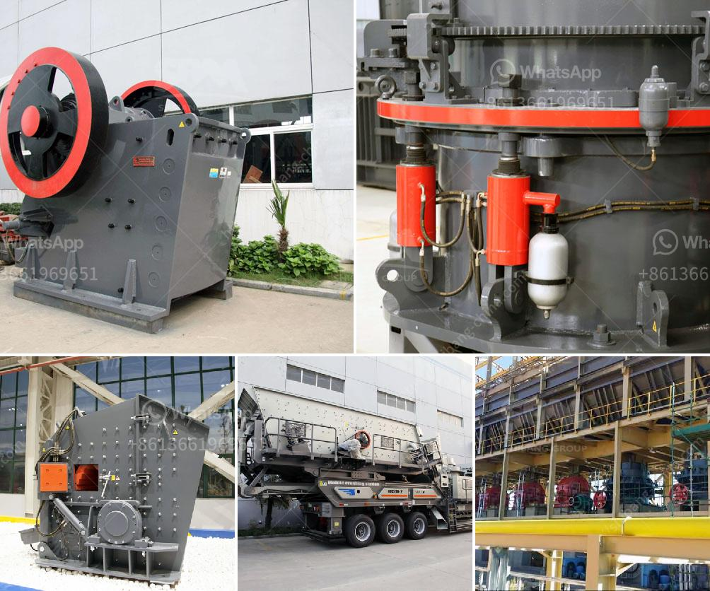

<h3>adjustement of gradation at crusher plant</h3>
In any crushing operation, the gradation of the crushed material is of utmost importance. The gradation, or the size distribution of the particles, directly affects the physical properties of the final product, such as its strength, durability, and shape. Therefore, proper adjustment of the gradation at the crusher plant is essential for producing high-quality materials that meet industry standards.

The gradation at the crusher plant refers to the distribution of different sizes of aggregate materials, such as stones and sands, which are used in construction and other industries. This gradation is determined by a sieve analysis, which involves passing the aggregate material through a series of sieves with different mesh sizes to separate them into different size fractions.

The primary crusher, which is usually a jaw crusher, is responsible for reducing the size of the aggregate material to a suitable size for further processing. The secondary and tertiary crushers further refine the material to achieve the desired gradation. This process involves adjusting the crusher settings, such as the closed side setting (CSS), the throw, and the eccentric speed, to control the size distribution of the crushed material.

To adjust the gradation at the crusher plant, several factors need to be considered. The first factor is the type of rock being crushed. Different rocks have different properties, such as hardness, abrasiveness, and shape. Each type of rock requires different crusher settings to achieve the desired gradation. For example, a harder rock may require a smaller CSS setting to produce the desired amount of fines, while a softer rock may require a larger CSS setting to avoid excessive fines.

Another factor to consider is the target gradation. Depending on the application and specifications, different gradations may be required. For example, a concrete aggregate may require a well-graded mixture of different sizes, while a road base material may require a more uniform gradation. By adjusting the crusher settings, the plant operator can control the size distribution of the crushed material to meet these specific requirements.

The crusher settings can be adjusted manually or automatically, depending on the plant's capabilities. Manual adjustment involves physically changing the CSS setting or the crusher's eccentric speed. This method allows for more flexibility and precision in achieving the desired gradation. However, it requires skilled operators and can be time-consuming.

On the other hand, automatic adjustment systems, such as hydraulic systems or electronic controls, can provide more efficient and consistent adjustments. These systems monitor various parameters, such as the load on the crusher, the feed rate, and the power consumption, and adjust the crusher settings accordingly. This automation allows for real-time optimization of the crusher's performance, leading to improved gradation control and overall productivity.

In conclusion, achieving the desired gradation at the crusher plant is crucial for producing high-quality materials. By adjusting the crusher settings, operators can control the size distribution of the crushed material to meet specific requirements. Factors such as the type of rock being crushed and the target gradation need to be considered when making these adjustments. Whether done manually or automatically, proper gradation adjustment plays a significant role in producing consistent and reliable materials for various applications.
<h3>Contact us</h3><ul><li><strong>Whatsapp:&nbsp;<a href="https://wa.me/8613661969651">+8613661969651</a></strong></li><li><a href="https://swt.shibang-china.com/?git&amp;zhl&amp;adjustement of gradation at crusher plant"><strong>Online Service(chat now)</strong></a></li></ul><h3>Related</h3><ul><li><a href='transport system in a mineral crusher.md'>transport system in a mineral crusher</a></li><li><a href='ball mill forge price.md'>ball mill forge price</a></li><li><a href='basalt crushing processing.md'>basalt crushing processing</a></li><li><a href='vibrating screen for 150 microns.md'>vibrating screen for 150 microns</a></li><li><a href='gravimetric centrifugal gold concentrator.md'>gravimetric centrifugal gold concentrator</a></li></ul>