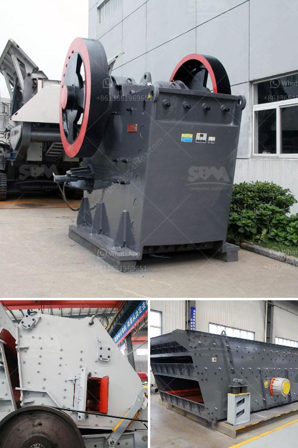

<h3>advances in hammer mills</h3>
Hammer mills are crucial equipment in the agricultural and food processing industries, as they efficiently grind and process a wide variety of materials to desired sizes. Recent advances in hammer mill technology have brought about significant improvements in efficiency, durability, and versatility.

One major advancement in hammer mills is the incorporation of airflow technology, which aids in the cooling and drying of materials during the grinding process. By introducing controlled airflow into the system, operators can reduce the potential for clogging and enhance production rates, resulting in higher throughput and reduced energy consumption.

Moreover, the advent of advanced control systems has made hammer mills more efficient, allowing operators to optimize their performance to ensure consistent and uniform particle size distribution. These systems enable finer control of the grinding process, ensuring that materials are ground to the desired specifications, increasing product quality.

Additionally, the development of improved hammer designs has allowed for enhanced grinding efficiency and reduced wear. Advanced materials and engineering techniques have significantly extended the lifespan of hammer mill components, lowering maintenance costs and increasing uptime.

One noteworthy advance is the integration of particle size separation technology into hammer mills, allowing for the separation and collection of different particle sizes. This innovation facilitates the production of uniform and customized products, meeting the diverse demands of various industries, from animal feed to biomass energy production.

Furthermore, the use of computer-aided design (CAD) and simulation software has revolutionized hammer mill manufacture and development. These tools enable manufacturers to design and test prototypes virtually, reducing costs and accelerating the innovation process. CAD also allows for precise customization and refinement, ensuring the optimal design for specific applications.

In conclusion, these recent advancements in hammer mill technology have revolutionized the grinding process, enhancing the efficiency, durability, and versatility of these crucial machines. With improved cooling capabilities, advanced control systems, innovative hammer designs, particle size separation, and the integration of CAD tools, hammer mills have become more efficient, reliable, and adaptable, meeting the diverse needs of modern industries. As technology continues to evolve, we can expect further advancements that will drive the efficiency of hammer mills to even greater heights.
<h3>Contact us</h3><ul><li><strong>Whatsapp:&nbsp;<a href="https://wa.me/8613661969651">+8613661969651</a></strong></li><li><a href="https://swt.shibang-china.com/?git&amp;zhl&amp;advances in hammer mills"><strong>Online Service(chat now)</strong></a></li></ul><h3>Related</h3><ul><li><a href='cement vertical mill tph kenya.md'>cement vertical mill tph kenya</a></li><li><a href='mobile concrete crusher trailer mounted.md'>mobile concrete crusher trailer mounted</a></li><li><a href='small scale gypsum powder production line.md'>small scale gypsum powder production line</a></li><li><a href='cost of gypsum mining equipment.md'>cost of gypsum mining equipment</a></li><li><a href='top roller mills for sale.md'>top roller mills for sale</a></li></ul>