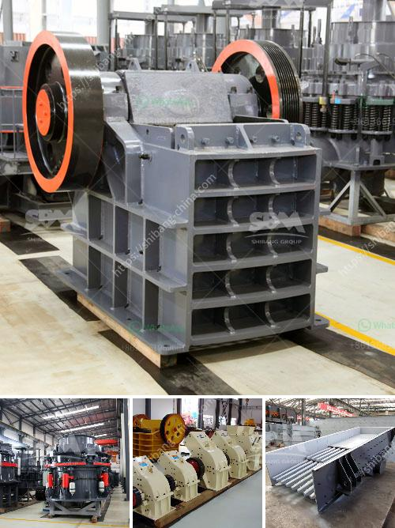

<h3>advantages of hammer mill</h3>
People use hammer mills for various purposes ranging from making flour to grain shredding and even waste management. The major advantage of using a hammer mill is that it can be conveniently and flexibly operated. This makes it an essential tool for small-scale farmers, business owners, and individuals involved in the food processing industry.

One of the key advantages of a hammer mill is its ability to produce a wide range of particle sizes. This results in greater flexibility in the types of raw materials that can be processed. The small particle sizes generated by the hammer mill make it an excellent choice for granulation purposes. For example, hammer mills are often used to create granules from scrap wood, which can then be used as fuel or animal bedding.

Another advantage of using a hammer mill is the savings it brings. With the use of a hammer mill, the whole process of preparing raw materials becomes highly efficient and cost-effective. This is because the hammer mill can do the grinding operations at a faster pace compared to other machines. Furthermore, it requires less energy consumption, especially during the grinding process.

The hammer mill is also very easy to maintain. It is designed with outstanding simplicity, making operation and cleaning straightforward. As a result, people can regularly clean the equipment in order to avoid any possible contamination or bacteria growth. This is particularly crucial in the food industry where hygiene and cleanliness are of utmost importance.

In addition to the ease of maintenance, hammer mills have a long lifespan. They are built to withstand wear and tear, ensuring maximum durability and reliability. This enables businesses and individuals to enjoy the benefits of their investment for many years, without needing frequent repairs or replacements.

One of the most significant advantages of a hammer mill is its ability to slash the cost of electricity bills. This is due to the use of fuel-efficient motors that provide optimal power with minimal energy consumption. As a result, businesses can significantly reduce their operational costs and increase profit margins.

Furthermore, a hammer mill can also be used for waste management. Many industries generate waste materials that need to be properly disposed of. With a hammer mill, these waste materials can be pulverized and recycled into useful products. This helps reduce environmental pollution and promotes a sustainable approach towards waste management.

Lastly, hammer mills come in various sizes and designs, making them suitable for different applications and industries. Whether it is the food industry, pharmaceutical industry, or mining sector, there is a specific type of hammer mill that can effectively meet the unique requirements of each industry. The versatility of the hammer mill allows businesses to tailor its use to suit their specific needs.

In conclusion, a hammer mill offers numerous advantages for different industries and individuals. Its ability to produce a wide range of particle sizes, efficiently grind materials, easy maintenance, and cost-saving features make it an ideal machine for various purposes such as granulation, waste management, and more. With the wide availability of different types of hammer mills, businesses and individuals can find the perfect match for their specific needs.
<h3>Contact us</h3><ul><li><strong>Whatsapp:&nbsp;<a href="https://wa.me/8613661969651">+8613661969651</a></strong></li><li><a href="https://swt.shibang-china.com/?git&amp;zhl&amp;advantages of hammer mill"><strong>Online Service(chat now)</strong></a></li></ul><h3>Related</h3><ul><li><a href='crusher on rent in india.md'>crusher on rent in india</a></li><li><a href='manufacturing equipments of lime stone milling.md'>manufacturing equipments of lime stone milling</a></li><li><a href='granite machine concrete.md'>granite machine concrete</a></li><li><a href='crusher plant in india.md'>crusher plant in india</a></li><li><a href='three ring micro powder mill.md'>three ring micro powder mill</a></li></ul>