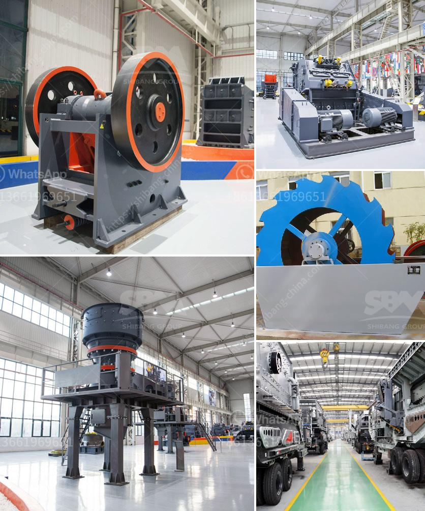

<h3>aggregate crusher machine suppliers</h3>
Aggregate crusher machine is used in mining, construction, highway, railway, metallurgy, irrigation and chemical industries. The majority of the aggregates produced are used for construction purposes, but other smaller sectors, such as agriculture, landscaping, and drainage, also rely on this versatile material.

Aggregate crushers are used in mining, quarrying and recycling operations. Several types of crushers can be utilized, including jaw crushers, cone crushers, hammer crushers, and impact crushers. Each crusher has different specifications, and these vary according to the application. It is important to choose the correct crusher for an operation to ensure reliable performance and efficient production.

When it comes to buying an aggregate crusher, quality, reliability, and price are crucial factors to consider. Fortunately, there are reputable aggregate crusher machine suppliers who can provide dependable machines at competitive prices. Here are some top aggregate crusher machine suppliers in the industry:

1. Metso Outotec: With a history dating back over 150 years, Metso Outotec is a well-known and respected supplier of aggregate crushers. The company offers a wide range of jaw, cone, and impact crushers that are designed to enhance productivity and reduce downtime. Their machines are known for their robust construction, high efficiency, and advanced automation features.

2. Sandvik: Sandvik is a global supplier of aggregate crushers and other mining equipment. They offer a diverse range of crushers, including jaw, cone, and impact crushers, which are designed to meet the varied needs of different applications. Sandvik's crushers are known for their durable construction, high productivity, and efficient performance.

3. Thyssenkrupp: Thyssenkrupp is a leading supplier of aggregate crushers, offering a comprehensive range of machines designed to meet the specific requirements of customers. Their crushers are characterized by their rugged construction, high reliability, and superior performance. Thyssenkrupp's extensive network ensures timely delivery and excellent after-sales service.

4. Eagle Crusher: Eagle Crusher is a well-established manufacturer of high-quality aggregate crushers. They offer a comprehensive range of jaw crushers, cone crushers, and impact crushers, each designed to deliver maximum productivity and durability. Eagle Crusher's machines are known for their exceptional performance, easy maintenance, and long service life.

5. Terex MPS: Terex MPS is a reputed supplier of aggregate crushers, offering a wide range of machines to meet diverse customer requirements. Their crushers are known for their reliability, efficiency, and versatility. Terex MPS provides comprehensive support to customers, including installation, training, and after-sales service.

When considering an aggregate crusher machine supplier, it is important to evaluate factors such as machine quality, durability, efficiency, and after-sales service. Reputable suppliers provide machines that are designed to withstand harsh conditions and deliver consistent performance. They also offer timely support, ensuring minimal downtime and maximum productivity for the customer.

In conclusion, aggregate crusher machines are essential equipment in the construction, mining, and recycling industries. Reliable and efficient machines are important for ensuring smooth operations and maximum productivity. By choosing a reputable supplier and selecting the right machine for specific applications, customers can benefit from long-lasting, high-performance crushers that meet their requirements.
<h3>Contact us</h3><ul><li><strong>Whatsapp:&nbsp;<a href="https://wa.me/8613661969651">+8613661969651</a></strong></li><li><a href="https://swt.shibang-china.com/?git&amp;zhl&amp;aggregate crusher machine suppliers"><strong>Online Service(chat now)</strong></a></li></ul><h3>Related</h3><ul><li><a href='gravimetric centrifugal gold concentrator.md'>gravimetric centrifugal gold concentrator</a></li><li><a href='slag crusher machine kenya.md'>slag crusher machine kenya</a></li><li><a href='artificial stone production line.md'>artificial stone production line</a></li><li><a href='gypsum board machinery manufacturers turkey.md'>gypsum board machinery manufacturers turkey</a></li><li><a href='marble production line.md'>marble production line</a></li></ul>