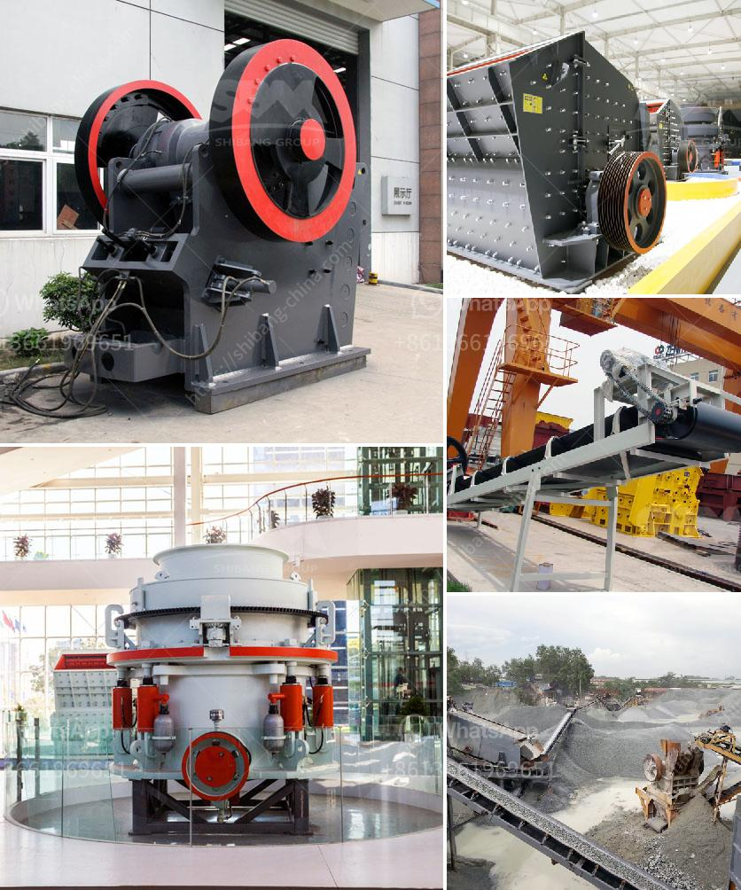

<h3>aggregate crusher plant layout</h3>
Aggregate crusher plant layout plays a significant role in producing crushed stone and aggregate materials. Its design principles adhere to the principle of operational reliability and stability while representing the technological state-of-the-art. The layout of the aggregate crushing plant is determined by the overall technological and economic parameters. However, the most important thing is to ensure that the plant meets the production requirements and operates efficiently.

One of the main considerations in designing the layout of an aggregate crushing plant is the placement of the crushing equipment. There are two basic types of crushing equipment: cone crushers and jaw crushers. Cone crushers are used for hard materials that need to be crushed into smaller size particles, while jaw crushers are mainly used for the primary crushing of various materials.

The aggregate crusher plant layout consists of feeders, crushers, screens, conveyors, and other equipment. The feeders ensure the flow of materials into the crushers, which is essential for efficient operation. Before crushing, the feeders regulate the flow of rocks or gravel to the crusher, preventing overloads or surges. The screens allow the desired size materials to be separated from the oversized ones. The conveyors move the materials between different stages of the crushing process.

In addition to the placement of the equipment, the layout also considers the flow of materials within the plant. The aggregate materials need to be transported from one stage to another with minimal disruption and delay. This requires efficient conveyor systems that can handle large volumes of materials. The design of the conveyors should consider factors such as belt width, speed, and inclination to ensure smooth material flow.

Another important aspect of the layout is the provision of sufficient space for maintenance and inspection activities. Regular maintenance is crucial for the smooth operation of the plant and to avoid unexpected breakdowns. Easy access to equipment and components is essential for maintenance teams to perform their tasks efficiently.

Safety is another critical consideration in the layout design. Safety measures should be incorporated into the layout to protect workers and prevent accidents. This can include the installation of safety guards on crushers and conveyors, clear signage, and designated walkways.

The final consideration in the aggregate crusher plant layout is the incorporation of environmental protection measures. The crushing process generates dust, noise, and water pollution. Strict environmental regulations must be adhered to ensure that the plant operates within acceptable limits. Measures such as dust suppression systems, noise barriers, and wastewater treatment facilities should be included in the design.

In conclusion, the layout of an aggregate crushing plant plays a significant role in its overall performance and productivity. It integrates the equipment, material flow, maintenance access, safety, and environmental considerations. A well-designed layout ensures smooth and efficient operation, optimal production, and compliance with regulatory requirements. Thus, it is essential to carefully consider all these factors when planning the layout of an aggregate crusher plant.
<h3>Contact us</h3><ul><li><strong>Whatsapp:&nbsp;<a href="https://wa.me/8613661969651">+8613661969651</a></strong></li><li><a href="https://swt.shibang-china.com/?git&amp;zhl&amp;aggregate crusher plant layout"><strong>Online Service(chat now)</strong></a></li></ul><h3>Related</h3><ul><li><a href='difference between pebble and rock.md'>difference between pebble and rock</a></li><li><a href='jaw crusher baxter.md'>jaw crusher baxter</a></li><li><a href='bauxite processing plant project cost.md'>bauxite processing plant project cost</a></li><li><a href='ball mill zenit crusher china.md'>ball mill zenit crusher china</a></li><li><a href='dolomite stone crusher plant cost.md'>dolomite stone crusher plant cost</a></li></ul>