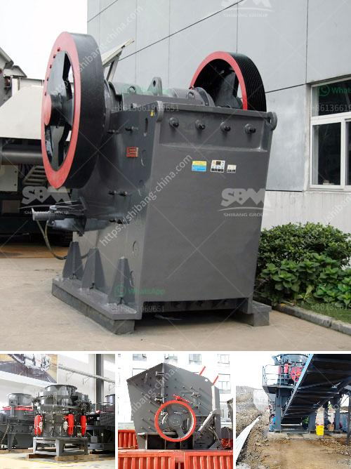

<h3>aggregate crusher plants</h3>
Aggregate crusher plants are crucial for the construction industry as they provide vital materials required for the creation of roads, bridges, buildings, and other infrastructure. Furthermore, they enable owners to produce a high-quality product, which is essential for meeting the demands of various construction projects.

These plants consist of different stages of crushing and screening processes that efficiently break down large rocks into smaller, more manageable sizes. The primary crusher, commonly known as a jaw crusher, utilizes compressive force to crush materials, while the secondary and tertiary crushers break down the material further.

One notable feature of these plants is their ability to produce several types of aggregate materials simultaneously. This is made possible by the screens within the plant that separate different sizes of rocks before they are crushed.

Aggregates are essential construction materials as they provide strength, stability, and durability to various structures. They are utilized in the production of concrete, asphalt, and other construction applications. Without aggregate crusher plants, construction projects would be significantly delayed, and the quality of construction may be compromised.

Furthermore, these plants contribute to the sustainability of the construction industry, as they allow for the reuse of existing materials. Demolished concrete, for instance, can be crushed and recycled as aggregate for new construction projects, reducing the need for new raw materials and minimizing waste.

In conclusion, aggregate crusher plants play a vital role in the construction industry, as they provide the essential materials required for various construction projects. With the ability to produce different types of aggregate materials, these plants ensure that construction projects can meet the demands for high-quality materials while also contributing to sustainability efforts through recycling.
<h3>Contact us</h3><ul><li><strong>Whatsapp:&nbsp;<a href="https://wa.me/8613661969651">+8613661969651</a></strong></li><li><a href="https://swt.shibang-china.com/?git&amp;zhl&amp;aggregate crusher plants"><strong>Online Service(chat now)</strong></a></li></ul><h3>Related</h3><ul><li><a href='cost of gypsum mining equipment.md'>cost of gypsum mining equipment</a></li><li><a href='crushing sale rotary drum dryer cost.md'>crushing sale rotary drum dryer cost</a></li><li><a href='stone crusher cebu for sale in kenya.md'>stone crusher cebu for sale in kenya</a></li><li><a href='bentonite grinding machine manufacturer in india.md'>bentonite grinding machine manufacturer in india</a></li><li><a href='impact crushers for sale.md'>impact crushers for sale</a></li></ul>