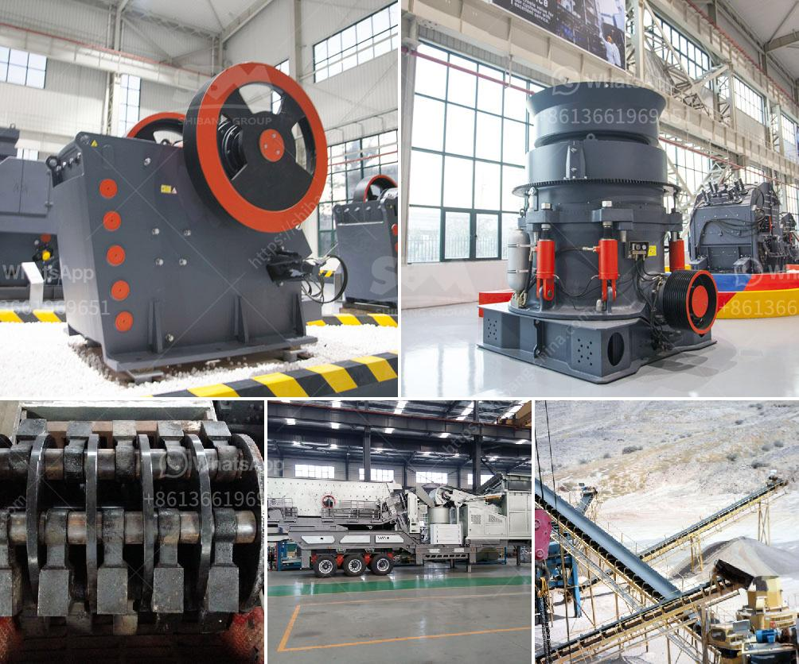

<h3>aggregate crushing process</h3>
Aggregate crushing process is a crucial part of producing high-quality aggregates for various uses such as road construction, concrete batching plant, asphalt mixing plant, and more. In this article, we will discuss the process of aggregate crushing and its importance in producing high-quality aggregates.

The primary objective of any crushing plant is to produce high-quality aggregates for various applications. With the advancement of technology and mechanical equipment, the process of crushing aggregates has been made more efficient. In general, the aggregate crushing process consists of primary, secondary, and tertiary crushing stages. Each stage plays a crucial role in producing high-quality aggregates.

The primary crushing stage involves the breaking down of bulk materials into smaller pieces. This is usually done by a jaw crusher, which uses compressive force to break the materials. The raw materials are fed into the jaw crusher through a vibrating grizzly feeder, which can remove undersized or contaminated materials. The jaw crusher then crushes the materials into smaller sizes, typically between 100mm and 300mm.

The secondary crushing stage further reduces the size of the aggregates obtained from the primary crushing stage. This is usually done by a cone crusher, which uses a gyrating mantle to exert pressure on the material, crushing it against the concave bowl liner. The cone crusher produces aggregates of a more uniform shape and size compared to the jaw crusher. The crushed aggregates are typically between 20mm and 50mm.

The tertiary crushing stage further reduces the size of the aggregates obtained from the secondary crushing stage. This is usually done by a vertical shaft impact crusher (VSI). The VSI crusher uses a rock-on-rock crushing principle, where rocks are fed into a spinning rotor, which accelerates and then discharges them against a stationary anvil or impact plate. The crushed aggregates obtained from the tertiary crushing stage are typically finer and shaped more cubically.

The aggregate crushing process is essential in producing high-quality aggregates that meet industry standards and specifications. By progressively crushing the aggregates into smaller sizes, the shape, surface texture, and grading of the aggregates can be optimized, resulting in improved workability, strength, and durability of the final products.

Moreover, the use of proper crushing equipment minimizes the generation of fines, which are unwanted particles that can result in poor workability and increased risk of segregation. The control of fines is crucial in producing high-quality aggregates, as excessive fines can negatively impact the performance of the concrete or asphalt mix.

In addition to producing high-quality aggregates, the crushing process also has economic benefits. Proper sizing and grading of aggregates can reduce the consumption of cement, water, and other costly materials in the production of concrete and asphalt. This not only results in cost savings but also helps in reducing the environmental impact associated with the extraction and production of these materials.

In conclusion, the aggregate crushing process is a crucial part of producing high-quality aggregates for various applications. The primary, secondary, and tertiary crushing stages help in optimizing shape, surface texture, and grading of the aggregates, resulting in improved workability, strength, and durability of the final products. By using proper crushing equipment, the generation of fines can be minimized, ensuring high-quality aggregates while also providing economic and environmental benefits.
<h3>Contact us</h3><ul><li><strong>Whatsapp:&nbsp;<a href="https://wa.me/8613661969651">+8613661969651</a></strong></li><li><a href="https://swt.shibang-china.com/?git&amp;zhl&amp;aggregate crushing process"><strong>Online Service(chat now)</strong></a></li></ul><h3>Related</h3><ul><li><a href='roll crusher for various size coal.md'>roll crusher for various size coal</a></li><li><a href='looking for washing plant for gold germany.md'>looking for washing plant for gold germany</a></li><li><a href='italia crusher machine.md'>italia crusher machine</a></li><li><a href='materials used in mining gold and diamond.md'>materials used in mining gold and diamond</a></li><li><a href='list of machinery for 3000 tonnes per hour crusher.md'>list of machinery for 3000 tonnes per hour crusher</a></li></ul>