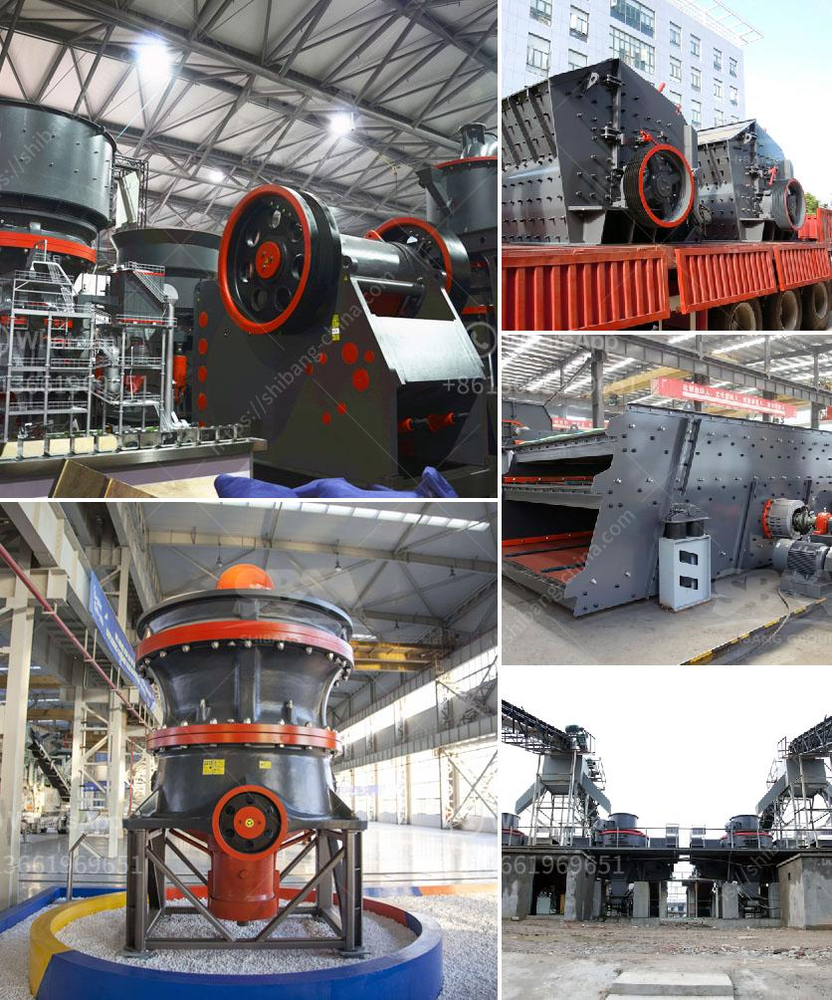

<h3>aggregate for cement block making</h3>
Cement blocks, also known as concrete blocks or cinder blocks, are widely used in the construction industry due to their durability, versatility, and cost-effectiveness. These blocks are primarily composed of cement, aggregate, and water, with aggregate playing a crucial role in determining the strength and structural integrity of the final product.

Aggregate refers to a mixture of sand, gravel, crushed stone, or other materials that are commonly added to cement to form concrete. It acts as a filler, providing volume and stability to the mixture while also enhancing its overall performance. The quality and characteristics of the aggregate significantly impact the durability and compressive strength of cement blocks.

One of the key factors that cement block manufacturers consider when selecting aggregate is its particle size and distribution. The aggregate particles need to be properly graded, i.e., they should have a range of sizes to ensure dense packing and optimal interlocking. This helps in minimizing voids within the cement block, increasing its density and making it more resistant to cracking and moisture penetration.

Additionally, the shape of the aggregate particles also plays a crucial role in the strength and workability of cement blocks. Angular or irregularly shaped aggregates tend to interlock more effectively, resulting in better cohesion and a stronger bond between the cement paste and the aggregate. On the other hand, smooth or rounded aggregates may reduce the overall strength of the block.

Furthermore, the type and quality of aggregate used in cement block making are determined by the specific requirements of the project. For example, if the blocks are intended for load-bearing walls or heavy-duty structures, a higher strength aggregate such as crushed stone or gravel should be used to withstand greater pressures. In contrast, fine sand or lightweight aggregates may be suitable for non-load-bearing walls or decorative applications.

The composition of aggregate also plays a crucial role in the properties of cement blocks. It is important to ensure that the aggregate used is free from impurities such as clay, silt, or organic materials, as these can negatively affect the properties of the concrete mixture. Too much clay or silt content can lead to poor workability, reduced durability, and increased water absorption, compromising the overall quality of the cement blocks.

Moreover, the moisture content of the aggregate must be closely monitored to avoid variations in the water-cement ratio, which can adversely affect the strength and consistency of the blocks. Excess moisture in the aggregate can result in a diluted cement paste, leading to reduced strength, increased porosity, and decreased resistance to freeze-thaw cycles.

In conclusion, aggregate is a vital component in the production of high-quality cement blocks. The selection and proper proportioning of aggregate contribute to the durability, strength, and performance of the final product. Visual appearance, particle size distribution, shape, and absence of impurities must all be carefully considered to ensure optimal results. By incorporating the right aggregate, manufacturers can produce cement blocks that are structurally sound, long-lasting, and meet the diverse needs of the construction industry.
<h3>Contact us</h3><ul><li><strong>Whatsapp:&nbsp;<a href="https://wa.me/8613661969651">+8613661969651</a></strong></li><li><a href="https://swt.shibang-china.com/?git&amp;zhl&amp;aggregate for cement block making"><strong>Online Service(chat now)</strong></a></li></ul><h3>Related</h3><ul><li><a href='cracker roller mill limestone.md'>cracker roller mill limestone</a></li><li><a href='crushing plants for sale.md'>crushing plants for sale</a></li><li><a href='grinding and mixing machine for quartz.md'>grinding and mixing machine for quartz</a></li><li><a href='marble quarry equipment.md'>marble quarry equipment</a></li><li><a href='cone crusher sri lanka for sale.md'>cone crusher sri lanka for sale</a></li></ul>