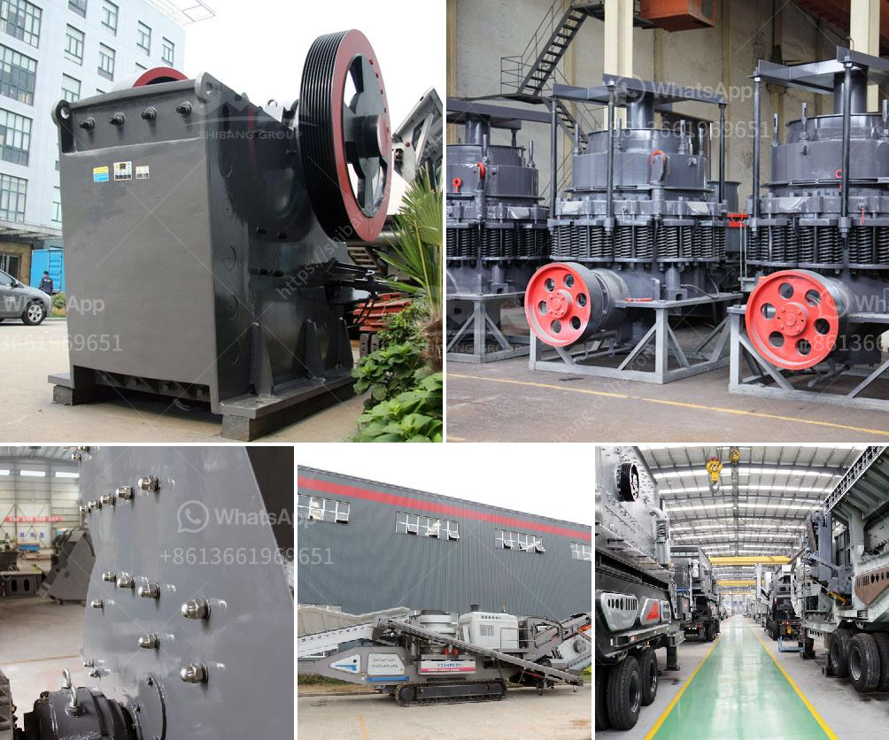

<h3>aggregate vibrating screens</h3>
Aggregate vibrating screens are widely used in the production of aggregates for construction purposes. These screens help separate large particles from small ones, ensuring efficient and accurate grading. With their robust construction and high-quality materials, aggregate vibrating screens can withstand the harsh demands of the aggregates industry.

One of the key advantages of aggregate vibrating screens is their ability to handle a wide range of materials. From sand and gravel to crushed stone and recycled concrete, these screens can effectively process diverse materials. This versatility is vital for aggregate producers who deal with multiple types of aggregates in their operations.

The design of aggregate vibrating screens also contributes to their effectiveness. These screens feature a mesh-like surface with openings of various sizes. The size of the openings determines the grading of the aggregate material. By adjusting the size of the openings, producers can customize the grade of their aggregates to meet specific project requirements.

In addition to grading, aggregate vibrating screens also help remove unwanted particles from the material. This enhances the quality of the final product by ensuring that only clean and properly-sized aggregates are used. By removing contaminants like dirt, debris, and fines, these screens help produce aggregates that meet industry standards and customer expectations.

Aggregate vibrating screens are designed to operate efficiently for extended periods, minimizing downtime and maximizing productivity. Their robust construction ensures durability, even in demanding applications. High-quality materials, such as stainless steel, contribute to their longevity and resistance to wear and tear.

Furthermore, the maintenance and operation of aggregate vibrating screens are relatively straightforward. Regular cleaning and inspection, along with lubrication of moving parts, can help extend the lifespan of these screens. When necessary, replacing worn-out parts is also a simple task, ensuring continuous and reliable performance.

In conclusion, aggregate vibrating screens play a crucial role in the production of quality aggregates for construction purposes. Their ability to grade and separate materials efficiently makes them indispensable to the aggregates industry. With their versatility, robust construction, and straightforward maintenance, these screens are an essential piece of equipment for aggregate producers worldwide.
<h3>Contact us</h3><ul><li><strong>Whatsapp:&nbsp;<a href="https://wa.me/8613661969651">+8613661969651</a></strong></li><li><a href="https://swt.shibang-china.com/?git&amp;zhl&amp;aggregate vibrating screens"><strong>Online Service(chat now)</strong></a></li></ul><h3>Related</h3><ul><li><a href='impact crushers for sale.md'>impact crushers for sale</a></li><li><a href='marble production line.md'>marble production line</a></li><li><a href='jaw crusher vs gyratory crusher stone crusher quarry.md'>jaw crusher vs gyratory crusher stone crusher quarry</a></li><li><a href='mineral grinding corporation.md'>mineral grinding corporation</a></li><li><a href='prices of copper smelting plant.md'>prices of copper smelting plant</a></li></ul>