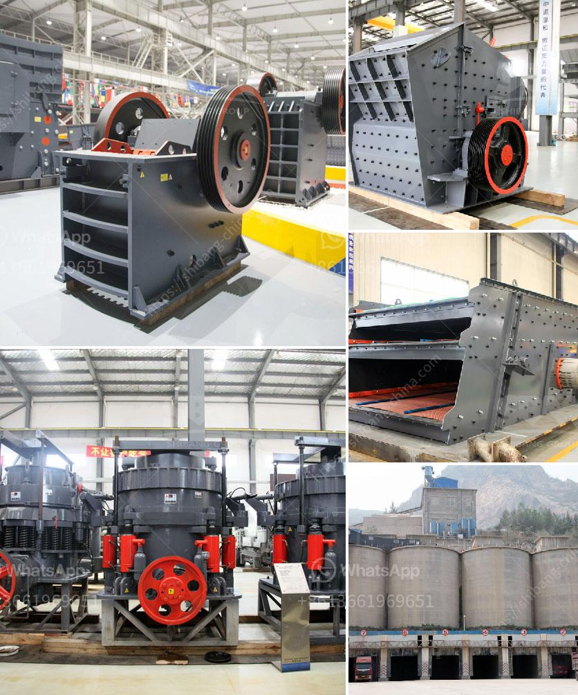

<h3>aggregate washing machine for sale</h3>
When it comes to maintaining cleanliness and sustainability in construction projects, one can never overlook the importance of aggregate washing machines. These machines are specifically designed to clean and remove impurities from gravel, sand, and other aggregates used in various construction applications. With their efficient cleaning process, aggregate washing machines ensure the production of high-quality material that meets industry standards. If you're in search of an aggregate washing machine for sale, this article will guide you through the features and benefits you should consider.

First and foremost, it's crucial to understand the significance of using a reliable aggregate washing machine. As construction projects require large quantities of aggregates, it's common for them to contain a considerable amount of impurities like dirt, dust, clay, and other unwanted particles. These impurities not only affect the overall quality of the final product but also have adverse effects on the structures built using these materials. Therefore, investing in an aggregate washing machine is a wise decision to ensure the production of clean and high-quality aggregates.

One of the key features to consider in an aggregate washing machine is its capacity. Depending on the scale of your construction project, you will need a machine with a suitable capacity. A good range to consider is between 50 and 200 tons per hour, as it caters to most project sizes. However, keep in mind that higher capacities generally come at a higher cost. Therefore, it's essential to assess your project requirements and budget before making a purchase.

Another important consideration is the efficiency and effectiveness of the machine's cleaning process. The aggregate washing machine you choose should be able to remove a significant amount of impurities, ensuring that the final product is clean and usable. Look for machines that incorporate robust washing mechanisms such as rotary drum scrubbers, log washers, and coarse material washers. These mechanisms help in thoroughly cleaning the aggregates and eliminating any unwanted residues.

Moreover, the durability and longevity of the machine should not be overlooked. Construction projects often involve heavy-duty use, and your aggregate washing machine must be able to withstand the demanding conditions. Look for machines constructed with high-quality materials, such as stainless steel or durable alloys, as they offer better resistance to corrosion and wear. Additionally, a machine equipped with reliable and easily replaceable parts will reduce downtime and maintenance costs, ensuring uninterrupted operation.

Lastly, considering the post-sales support provided by the manufacturer or supplier is essential. A reliable company should offer technical assistance, spare parts availability, and regular servicing options. Since aggregate washing machines are capital-intensive investments, having a trusted partner who can provide prompt support and assistance can greatly enhance your overall experience.

In conclusion, investing in an aggregate washing machine for sale is a smart choice for construction projects aiming to produce clean and high-quality aggregates. Features like capacity, cleaning efficiency, durability, and post-sales support should be carefully evaluated to make an informed decision. By choosing the right machine, you can ensure a sustainable construction process while delivering superior results.
<h3>Contact us</h3><ul><li><strong>Whatsapp:&nbsp;<a href="https://wa.me/8613661969651">+8613661969651</a></strong></li><li><a href="https://swt.shibang-china.com/?git&amp;zhl&amp;aggregate washing machine for sale"><strong>Online Service(chat now)</strong></a></li></ul><h3>Related</h3><ul><li><a href='roller mill for mantles.md'>roller mill for mantles</a></li><li><a href='mining equipment for sale.md'>mining equipment for sale</a></li><li><a href='mica processing plant per ton.md'>mica processing plant per ton</a></li><li><a href='stone crusher owners of khurda.md'>stone crusher owners of khurda</a></li><li><a href='difference between ball mills and tube mills.md'>difference between ball mills and tube mills</a></li></ul>