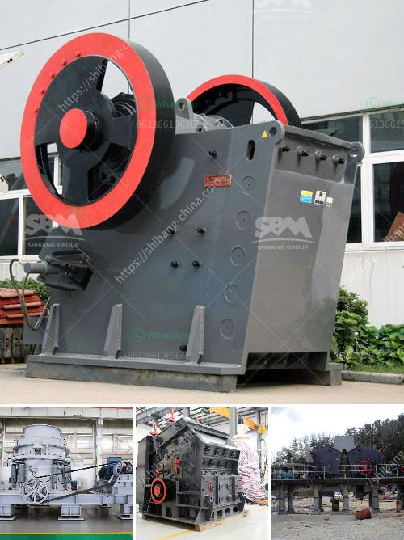

<h3>aggregates crusher philippines</h3>
In the Philippines, the construction industry has been growing at a rapid pace. More structures, buildings, and infrastructures are being built, fueling the demand for high-quality aggregates. This has led to numerous quarries and crushers operating in different regions and cities all over the country.

An aggregates crusher is an important equipment in the construction industry, especially for road projects, mining operations, and building constructions. But before it can be utilized, it must undergo a series of crushing processes to produce the desired size of aggregate materials.

To ensure the effectiveness of crusher plants, one must consider several factors, such as the hardness of the material to be crushed, the types of rocks present in the area, and the size of the rocks. After assessing these factors, it is essential to choose an appropriate crusher unit to make sure the aggregate materials meet the required specifications.

The Philippines is rich in mineral resources, and its construction aggregates are considered among the best in the world. One of the promising pieces of equipment for processing these aggregates is the aggregates crusher. With an extensive range of machines and the latest technology in crushing, it increases productivity while minimizing operational costs.

Additionally, aggregates crushers in the Philippines are versatile machines that can be used in different industries. They are primarily used in the mining, concrete, and asphalt industries. But these machines can also be utilized in other sectors, such as metallurgy and chemical production, to produce fine materials for various applications.

The aggregates crusher Philippines offers countless benefits for contractors and construction companies. It ensures the production of quality aggregates that comply with industry standards. Moreover, it helps reduce costs, enhance efficiency, and promote sustainability by minimizing the need for quarrying and reducing landfill waste.

In conclusion, aggregates crusher Philippines plays a crucial role in the construction industry. Its high-quality machines provide efficient and effective solutions for various construction projects. With the growing demand for aggregates, these crushers are essential equipment for any construction company aiming to deliver top-notch results.
<h3>Contact us</h3><ul><li><strong>Whatsapp:&nbsp;<a href="https://wa.me/8613661969651">+8613661969651</a></strong></li><li><a href="https://swt.shibang-china.com/?git&amp;zhl&amp;aggregates crusher philippines"><strong>Online Service(chat now)</strong></a></li></ul><h3>Related</h3><ul><li><a href='small motor ore crusher for home.md'>small motor ore crusher for home</a></li><li><a href='ball mill forge price.md'>ball mill forge price</a></li><li><a href='buy gravel crusher.md'>buy gravel crusher</a></li><li><a href='grinding garnet machine.md'>grinding garnet machine</a></li><li><a href='sayaji impact crusher specifications.md'>sayaji impact crusher specifications</a></li></ul>