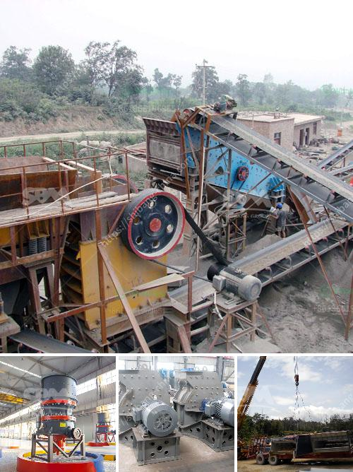

<h3>allis jaw crushers</h3>
When it comes to quarrying and mining operations, there are a wide range of jaw crushers available for various applications. However, few crushers can match the versatility and productivity of the Allis jaw crusher. The wide range of jaw plate designs available ensures varied crushing applications, as well as improving the efficiency and productivity of your operation.

Allis jaw crushers have been around for nearly a century, making them one of the most iconic machines in the industry. As an extremely versatile piece of machinery, the Allis jaw crusher can produce a wide range of different products, such as topsoil, gravel, crushed rock, and sand. The in-built flexibility also means that the crusher can adapt to different job requirements with ease, making it suitable for both smaller operations and larger production sites.

One of the key features of the Allis jaw crusher is its ability to crush rocks of various sizes thanks to the adjustable jaw design. With the movable jaw plate positioned at an angle, larger rocks can be crushed more easily. This unique design also allows for efficient discharge clearance, ensuring that smaller materials are efficiently separated from larger ones.

Allis jaw crushers offer multiple benefits for quarrying and mining operations, including improved productivity, reduced downtime and costs due to maintenance, and a lower overall operational expenditure. The jaw crushers also include premium-quality hydraulic cylinders, which help to reduce the amount of time required for maintenance and ensure a safe and fast replacement process.

Safety is a top priority for Allis jaw crushers, and they are equipped with essential safety features to minimize the risk of accidents and ensure the wellbeing of operators. These safety features include strong, durable handrails and safety guards, as well as emergency stop buttons located at easily reachable positions.

In addition to being highly productive and safe, Allis jaw crushers are also designed for ease of use. They are equipped with user-friendly controls, making them straightforward to operate even for less experienced users. The ergonomic design of the crushers allows for easy access to critical maintenance areas, further reducing downtime and increasing the overall efficiency of your operation.

To summarize, Allis jaw crushers are a versatile solution for quarrying and mining operations, offering excellent productivity and safety features. With their adjustable jaw design, these crushers can efficiently crush rocks of various sizes, ensuring a high-quality final product. They are also designed for easy maintenance, reducing downtime and lowering operational costs. Whether you are running a smaller operation or a large production site, Allis jaw crushers can adapt to your needs and deliver the results you are looking for.
<h3>Contact us</h3><ul><li><strong>Whatsapp:&nbsp;<a href="https://wa.me/8613661969651">+8613661969651</a></strong></li><li><a href="https://swt.shibang-china.com/?git&amp;zhl&amp;allis jaw crushers"><strong>Online Service(chat now)</strong></a></li></ul><h3>Related</h3><ul><li><a href='jaw crusher machine for sale.md'>jaw crusher machine for sale</a></li><li><a href='china gold dry washer manufacturer in philippines.md'>china gold dry washer manufacturer in philippines</a></li><li><a href='used cement mills for sale in india.md'>used cement mills for sale in india</a></li><li><a href='quartz stone machine in turkey.md'>quartz stone machine in turkey</a></li><li><a href='aggregate crusher machine suppliers.md'>aggregate crusher machine suppliers</a></li></ul>