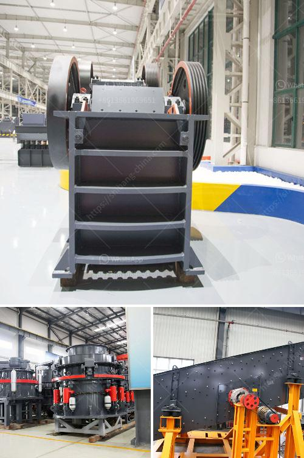

<h3>alluvial gold mining equipment price</h3>
Alluvial gold mining equipment price is a crucial consideration when planning to start an alluvial gold mining project. It determines the initial investment you are willing to make in order to set up your operation. To maximize profitability, it is essential to choose the right equipment specific to your project and budget. This article will highlight the factors that influence the alluvial gold mining equipment price and provide some insights into making an informed decision.

Firstly, the type and size of mining equipment significantly impact the price. Alluvial gold mining can be done through various methods, including panning, sluicing, and dredging. Each method requires specific equipment to effectively extract gold particles from the soil or water. For example, a gold pan is the most basic and affordable equipment for manual panning, while a larger-scale operation might require more specialized equipment such as a trommel or a suction dredge. As the complexity and efficiency of the equipment increase, so does the cost.

Secondly, the quality and durability of the equipment play a crucial role in determining the price. Investing in high-quality equipment ensures better performance, reduces maintenance costs, and increases the lifespan of the machinery. Inferior equipment may have a lower upfront cost but can lead to higher operational expenses in the long run. It is important to consider the reputation of the manufacturer or supplier and read customer reviews before making a purchasing decision. Opting for reputable brands or suppliers may result in a higher upfront cost but can provide better returns in the long term.

Another factor influencing the alluvial gold mining equipment price is the market demand. Gold prices fluctuate regularly, and as the demand for gold increases, so does the equipment price. With the current global economic uncertainty, gold has become a safe investment choice for many, driving up its demand and, consequently, the price of mining equipment. It is important to keep an eye on the market trends and make purchases at the right time to secure the best possible price.

Furthermore, the location and accessibility of the mining site affect the equipment price. Remote or hard-to-access areas may require additional transportation costs to deliver equipment, increasing the overall investment. Additionally, logistical challenges may arise, making it necessary to consider portable or mobile equipment, which usually comes at a higher price than stationary machinery.

Lastly, it is essential to consider the overall operational costs of the equipment when calculating the alluvial gold mining equipment price. These costs include fuel or electricity consumption, labor, maintenance, and any necessary permits or licenses. It is advisable to conduct thorough research and consult with industry experts to estimate these costs accurately.

In conclusion, the alluvial gold mining equipment price depends on various factors such as the type and size of the equipment, its quality and durability, market demand, location, and accessibility of the mining site, and the overall operational costs. In order to make an informed decision, one must carefully evaluate all these factors and come up with a cost-effective plan that maximizes profitability in the long term.
<h3>Contact us</h3><ul><li><strong>Whatsapp:&nbsp;<a href="https://wa.me/8613661969651">+8613661969651</a></strong></li><li><a href="https://swt.shibang-china.com/?git&amp;zhl&amp;alluvial gold mining equipment price"><strong>Online Service(chat now)</strong></a></li></ul><h3>Related</h3><ul><li><a href='feldspar grinding machine manufacturers in india.md'>feldspar grinding machine manufacturers in india</a></li><li><a href='limestone impact mill price.md'>limestone impact mill price</a></li><li><a href='what are they vertical grinding mills.md'>what are they vertical grinding mills</a></li><li><a href='used crusher for sale in tanzania.md'>used crusher for sale in tanzania</a></li><li><a href='tanzania gold crusher price.md'>tanzania gold crusher price</a></li></ul>