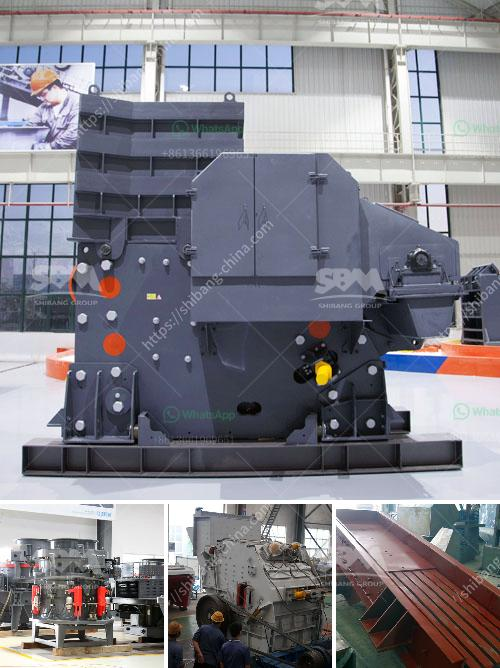

<h3>alluvial gold mining equipment used for sale</h3>
Alluvial gold mining equipment used for sale is a trusted and reliable option for your mineral extraction efforts. With its durable build, it ensures efficient operations and long-lasting performance. This equipment is specifically designed to break down the gold-bearing ore and separate the precious metals from the sand or gravel. It has been widely used in numerous gold mining projects due to its effectiveness in extracting gold particles.

The alluvial gold mining equipment used for sale are composed of several gravity concentrators, including jigs, spiral chutes, shaking tables, and sluice boxes. These concentrators work by continuously separating particles based on their specific gravity, allowing the lighter minerals to be collected and removed while the heavier ones are left behind. This process is commonly known as gravity separation and has been used extensively in the gold mining industry.

The selection of the appropriate alluvial gold mining equipment used for sale will depend on the type of deposit and the quantity of gold-bearing material to be processed. Various machines and tools can be utilized, such as excavators, wash plants, crushers, trommels, gold dredges, and hydraulic monitors. The quality and efficiency of these machines are crucial for successful gold extraction. Thus, it is important to choose equipment that is reliable, easy to operate, and low in maintenance.

When purchasing alluvial gold mining equipment, it is advisable to thoroughly inspect the machinery before finalizing the deal. Ensure that all components are in good working condition and that all necessary repairs have been made. Additionally, you should consider purchasing from a reputable seller or dealer who can provide proper product documentation and after-sales support.

In conclusion, alluvial gold mining equipment used for sale provides reliable and efficient extraction methods for the precious metal. Whether you are a small-scale miner or a large-scale operation, investing in quality equipment will lead to better financial returns. By carefully selecting and maintaining the machinery, you can ensure a smooth and profitable mining operation for years to come.
<h3>Contact us</h3><ul><li><strong>Whatsapp:&nbsp;<a href="https://wa.me/8613661969651">+8613661969651</a></strong></li><li><a href="https://swt.shibang-china.com/?git&amp;zhl&amp;alluvial gold mining equipment used for sale"><strong>Online Service(chat now)</strong></a></li></ul><h3>Related</h3><ul><li><a href='calcium carbonate limestone machine.md'>calcium carbonate limestone machine</a></li><li><a href='lime processing plant.md'>lime processing plant</a></li><li><a href='cement process making in ashaka.md'>cement process making in ashaka</a></li><li><a href='calcite processing machine.md'>calcite processing machine</a></li><li><a href='silica sand stone machine china.md'>silica sand stone machine china</a></li></ul>