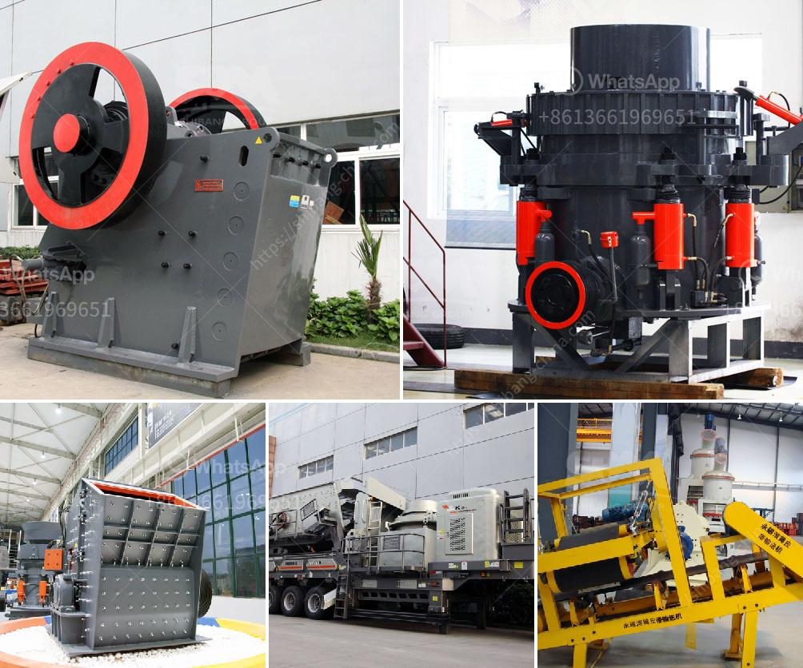

<h3>aluminum slag processing plant in germany</h3>
Aluminum slag is a byproduct of aluminum production and often considered as waste. However, with the advancement in technology and increasing environmental concerns, many countries including Germany have recognized the potential of utilizing aluminum slag as a valuable resource. As a result, several aluminum slag processing plants have been established in Germany.

One such plant is located in the industrial hub of Duisburg. This plant is equipped with state-of-the-art machinery and uses advanced techniques to extract aluminum from the slag. The process involves crushing and grinding the slag, followed by flotation and magnetic separation. Through this process, aluminum concentrate is obtained, which can be further processed into aluminum metal.

The establishment of aluminum slag processing plants in Germany has not only helped in reducing the environmental impact of aluminum production but also generated economic benefits. The extracted aluminum can be used in various industries, including automotive, construction, and packaging. This not only reduces the dependence on primary aluminum production but also conserves natural resources.

Furthermore, the aluminum slag processing plant employs a considerable number of skilled and semi-skilled workers, contributing to employment generation in the region. It also promotes research and development in the field of aluminum recycling and provides opportunities for innovation.

Moreover, processing aluminum slag reduces the need for landfill space, as the slag can be transformed into a valuable resource. This aligns with Germany's commitment to sustainable waste management practices and circular economy principles.

In conclusion, the aluminum slag processing plant in Germany plays a crucial role in the efficient utilization of aluminum waste and contributes to environmental sustainability. It not only extracts valuable aluminum from the slag but also generates economic benefits and employment opportunities. The establishment of such plants signifies Germany's commitment to a greener future and sets an example for other countries to follow.
<h3>Contact us</h3><ul><li><strong>Whatsapp:&nbsp;<a href="https://wa.me/8613661969651">+8613661969651</a></strong></li><li><a href="https://swt.shibang-china.com/?git&amp;zhl&amp;aluminum slag processing plant in germany"><strong>Online Service(chat now)</strong></a></li></ul><h3>Related</h3><ul><li><a href='iron ore crushing plant setup cost in india.md'>iron ore crushing plant setup cost in india</a></li><li><a href='sample of granite quarry proposal.md'>sample of granite quarry proposal</a></li><li><a href='mobile crusher supplier.md'>mobile crusher supplier</a></li><li><a href='slag grinding problems.md'>slag grinding problems</a></li><li><a href='china shanghai zenith company.md'>china shanghai zenith company</a></li></ul>