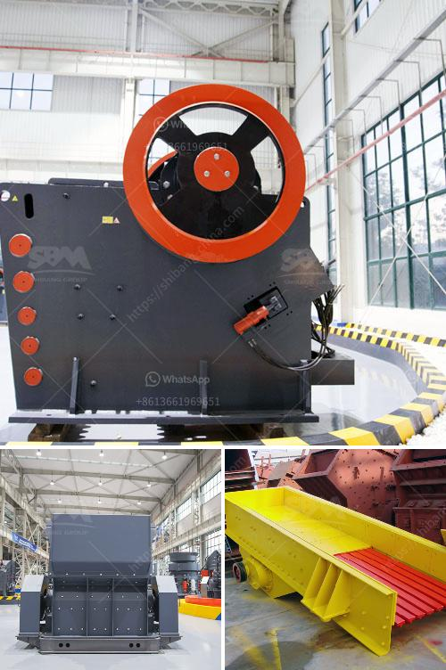

<h3>amp gravel conveyor belt</h3>
In the construction industry, the efficient movement of materials is crucial for timely project completion. One innovation that has revolutionized the way materials are transported is the amp gravel conveyor belt. This ingenious system has quickly become an essential tool for any construction site, offering a plethora of advantages.

The first and most apparent benefit of an amp gravel conveyor belt is its ability to transport large quantities of materials quickly. Traditional manual methods of material transportation, such as wheelbarrows or forklifts, can be time-consuming and labor-intensive. With a conveyor belt, materials are effortlessly moved from one location to another with minimal effort, enabling construction teams to focus on other important tasks.

Another advantage provided by amp gravel conveyor belts is their ability to move materials over long distances. Whether it is across a construction site or to a higher elevation, these belts excel at bridging gaps and bypassing obstacles. The adjustable incline of the belt allows for customization to navigate various terrains, making it versatile and adaptable to any project's needs.

Furthermore, amp gravel conveyor belts are known for their robust build quality and durability. Built to withstand the demanding conditions of construction sites, these belts are typically made of heavy-duty materials that can handle the weight and harsh environment. The durability of these belts ensures that they can withstand the constant movement of heavy materials, preventing breakdowns and minimizing downtime.

Safety is a paramount concern in the construction industry, and amp gravel conveyor belts address this issue efficiently. By removing the need for manual material handling, accidents such as strains, sprains, and back injuries can be significantly reduced. The risk of slips and trips is also diminished, as materials are securely placed on the conveyor belt without cluttering the work area.

Moreover, amp gravel conveyor belts promote environmental sustainability. They allow for the efficient use of resources by minimizing waste and optimizing material distribution. The controlled movement of materials on a conveyor belt ensures that there is little to no spillage, reducing clean-up efforts and preventing pollution. Additionally, the energy consumption of these belts is often minimal compared to alternative methods, making them an eco-friendly choice.

In summary, the amp gravel conveyor belt is a game-changer in the construction industry. Its ability to swiftly transport large quantities of materials, versatility in navigating various terrains, and robust build quality make it an invaluable tool on construction sites. Not only does it streamline material transportation, but it also prioritizes safety by reducing manual handling risks. Additionally, these belts contribute to environmental sustainability by minimizing waste and energy consumption. With all these advantages, it is no wonder that amp gravel conveyor belts have become a staple in modern construction practices.
<h3>Contact us</h3><ul><li><strong>Whatsapp:&nbsp;<a href="https://wa.me/8613661969651">+8613661969651</a></strong></li><li><a href="https://swt.shibang-china.com/?git&amp;zhl&amp;amp gravel conveyor belt"><strong>Online Service(chat now)</strong></a></li></ul><h3>Related</h3><ul><li><a href='hard rock ultrafine grinder in canada.md'>hard rock ultrafine grinder in canada</a></li><li><a href='bentonite grinding machine manufacturer in india.md'>bentonite grinding machine manufacturer in india</a></li><li><a href='quartz stone crusher manufacturing machines.md'>quartz stone crusher manufacturing machines</a></li><li><a href='copper slag manufacturing process.md'>copper slag manufacturing process</a></li><li><a href='allis jaw crushers.md'>allis jaw crushers</a></li></ul>