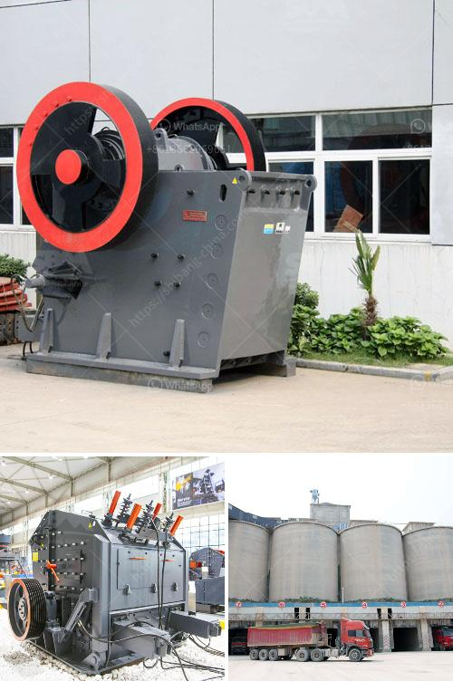

<h3>ansporting coal conveyor belt</h3>
Coal has long been a vital resource for various industries, providing a reliable and affordable source of energy. Yet, before it can be utilized, it must undergo a complex transportation process – and at the heart of this process lies the ever-reliable conveyor belt. Conveyor belts have been used for decades to transport coal efficiently and safely, ensuring a continuous supply of this valuable resource.

The transportation of coal from extraction sites to the end-user involves several stages. After the coal is mined, it needs to be processed and graded. Conveyor belts play a crucial role in this initial phase, as they transport the raw coal from the extraction sites to the processing plants. These belts are designed to withstand the harsh conditions of underground mines, operating smoothly and reliably even in cramped spaces and dim lighting.

Once the coal is processed and graded, the conveyor belts prove their mettle once again as they transport the graded coal to stockpiles or loading points. These belts are built to handle high capacities, ensuring a constant flow of coal to meet the demands of power plants, steel mills, and other industrial facilities. The belts’ robust construction allows them to withstand heavy loads and resist abrasion, ensuring minimal downtime and maximizing productivity.

Conveyor belts used for coal transportation are typically made of durable materials such as rubber, nylon, or steel. The choice of material depends on various factors, including the distance to be covered, the speed of operations, and the nature of the coal being transported. Rubber belts are common for short-distance transportation and are known for their flexibility, resistance to impact, and durability. On the other hand, steel-cord belts are ideal for long-distance applications, capable of carrying heavy loads over vast distances.

Safety is a paramount concern in any coal transportation operation. Conveyor belt systems are equipped with various safety features designed to protect workers and prevent accidents. Emergency stop buttons, trip wires, and pull-cord switches are strategically placed along the conveyor line to stop or reverse the belt in case of any potential danger. Furthermore, monitoring systems and sensors continuously monitor the operation, ensuring optimal performance and reducing the risk of breakdowns or malfunctions.

The advent of modern technology has further enhanced the efficiency and safety of coal transportation systems. Automated control systems make it easier to monitor and control the movement of coal along the belt, ensuring a smooth and uninterrupted flow. Advanced sensors constantly monitor various parameters such as belt tension, temperature, and speed, providing real-time data to operators for preventive maintenance and prompt troubleshooting. Additionally, thermal imaging cameras are employed to detect any abnormality or hotspots along the belt, enabling immediate actions to prevent potential fires.

In conclusion, conveyor belts are an indispensable component of the coal transportation process. From the initial extraction to the final delivery, coal relies on these belts’ resilience and efficiency to reach its intended destination. With their ability to handle heavy loads, resist abrasion, and incorporate advanced safety features, conveyor belts have proven themselves as a reliable and vital resource in the coal industry.
<h3>Contact us</h3><ul><li><strong>Whatsapp:&nbsp;<a href="https://wa.me/8613661969651">+8613661969651</a></strong></li><li><a href="https://swt.shibang-china.com/?git&amp;zhl&amp;ansporting coal conveyor belt"><strong>Online Service(chat now)</strong></a></li></ul><h3>Related</h3><ul><li><a href='ball milling method.md'>ball milling method</a></li><li><a href='cement ball mills charging.md'>cement ball mills charging</a></li><li><a href='crawler mobile crushing plants.md'>crawler mobile crushing plants</a></li><li><a href='project report of grinding mill.md'>project report of grinding mill</a></li><li><a href='stone crusher plan dwg.md'>stone crusher plan dwg</a></li></ul>