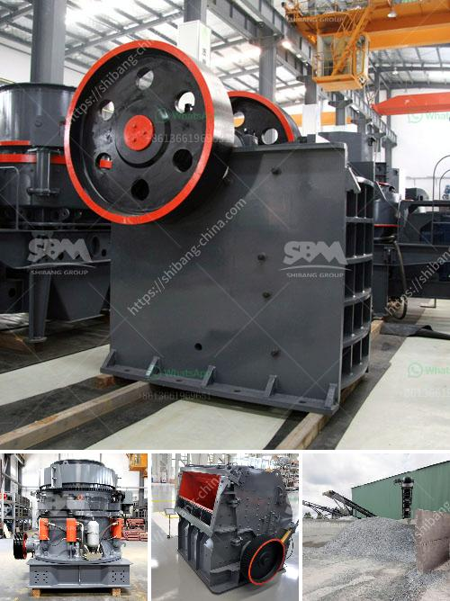

<h3>artificial sand making from sandstone</h3>
In recent years, the rapid development and urbanization of various regions across the globe have resulted in a significant increase in the demand for construction materials. One such crucial material is sand, which is extensively used in the construction industry. However, the extraction of natural sand has severe environmental implications, leading researchers and scientists to search for alternative solutions. One such innovative approach is artificial sand making from sandstone, which not only addresses the issues of environmental degradation but also ensures sustainable construction practices.

Sandstone, a sedimentary rock, is abundantly available in various regions. Traditionally, sandstone has been used as a building material due to its durability and flexibility. However, the extraction of natural sand from sandstone quarries has continued to cause detrimental effects on ecosystems, including the destruction of habitats and negatively impacting air and water quality. Additionally, the depletion of natural sand reserves poses a significant challenge for construction companies worldwide.

To overcome these challenges, researchers and scientists have developed a method to produce artificial sand from sandstone. This artificial sand making process involves crushing, grinding, and washing the sandstone into fine particles, which are then mixed with cement to create a high-quality construction material. This not only provides a sustainable alternative to natural sand but also enhances the properties of the final product.

Artificial sand, also known as crushed sand or manufactured sand, offers various advantages over natural sand. Firstly, it has a consistent particle size distribution, resulting in improved workability and a reduction in the amount of cement needed. This, in turn, minimizes the environmental impact associated with cement production. Additionally, the use of artificial sand eliminates the need for riverbed mining, preventing further damage to rivers and their ecosystems.

Moreover, artificial sand made from sandstone has better shape and surface texture compared to natural sand. This enhances the strength and durability of concrete, making it an ideal choice for various construction applications, including road construction, buildings, and infrastructure projects. Artificial sand can also be used in the manufacturing of precast concrete products, such as bricks, pavers, and tiles, ensuring the sustainable growth of the construction industry.

Furthermore, artificial sand can be produced by using waste materials, such as recycled concrete, quarry dust, and industrial waste, as a substitute for sandstone. This not only reduces the dependence on natural resources but also promotes the reuse and recycling of waste materials, contributing to a circular economy.

In conclusion, artificial sand making from sandstone presents an innovative solution to the environmental and sustainability challenges faced by the construction industry. By utilizing abundant sandstone resources, this process offers a sustainable alternative to natural sand extraction. With its improved properties and reduced environmental impact, artificial sand has the potential to revolutionize the construction sector, promoting a greener and more sustainable future. As further advancements are made in this field, it is crucial to encourage the adoption of artificial sand in construction practices, ensuring the preservation of our natural resources for generations to come.
<h3>Contact us</h3><ul><li><strong>Whatsapp:&nbsp;<a href="https://wa.me/8613661969651">+8613661969651</a></strong></li><li><a href="https://swt.shibang-china.com/?git&amp;zhl&amp;artificial sand making from sandstone"><strong>Online Service(chat now)</strong></a></li></ul><h3>Related</h3><ul><li><a href='coal powder plant.md'>coal powder plant</a></li><li><a href='used crusher for sale in tanzania.md'>used crusher for sale in tanzania</a></li><li><a href='crusher plants for sale.md'>crusher plants for sale</a></li><li><a href='project report of grinding mill.md'>project report of grinding mill</a></li><li><a href='gold processing equipment.md'>gold processing equipment</a></li></ul>