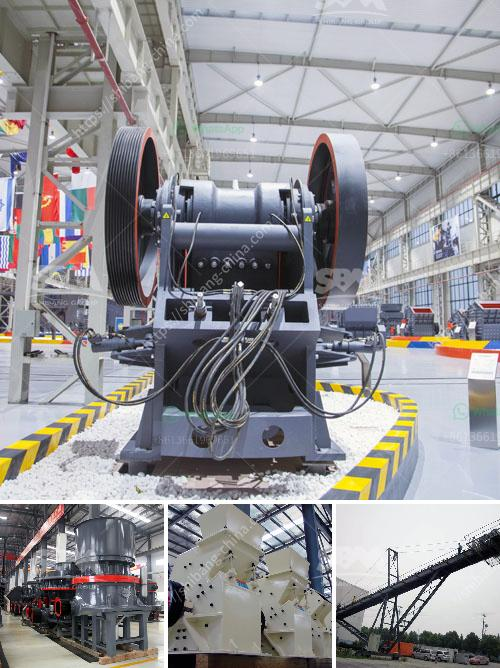

<h3>artificial stone production line</h3>
The construction industry has always been characterized by innovation, with new technologies constantly reshaping the way we build. One such revolution is the introduction of artificial stone production lines, a game-changer in the industry that has transformed the way we create aesthetically appealing and durable structures.

Artificial stone, also known as engineered stone or synthetic stone, is a composite material made of crushed stone bound together by an adhesive. Unlike natural stone, artificial stone can be manufactured in various colors, patterns, and textures, providing architects and designers with limitless possibilities when it comes to creating beautiful buildings.

The production of artificial stone involves a specialized production line that utilizes advanced machinery, molds, and cutting-edge technologies. This high-tech manufacturing process starts with the preparation of raw materials, including crushed stone, polyester resins, and pigments. These materials are carefully weighed and mixed to create a consistent and homogenous mixture.

Once the mixture is ready, it is poured into molds that are pre-designed to create specific shapes, sizes, and textures. The molds can be customized to replicate the appearance of various natural stones, such as marble, granite, or limestone. This replication ability allows for the creation of artificial stones that resemble expensive and rare natural stones at a fraction of the cost.

After pouring the mixture into molds, it goes through a process called vibration, which removes any air bubbles and ensures a solid and dense structure. The molds are then transferred to a curing chamber, where the artificial stone hardens and solidifies over time. This curing process is often accelerated by using heat and pressure, resulting in a product that is both strong and durable.

Artificial stone production lines have numerous advantages over using natural stone in construction. Firstly, artificial stone is more cost-effective, as it is manufactured using readily available materials and does not require expensive mining or extraction processes. Additionally, artificial stone is lighter in weight, making it easier to transport and install. It also provides better resistance to cracking, staining, and weathering, ensuring long-lasting beauty and structural integrity.

Another significant advantage of artificial stone production lines is their contribution to sustainable construction practices. By utilizing crushed stone waste, which is abundant in quarries and stone cutting factories, they reduce environmental impact and waste generation. Additionally, the production lines can incorporate recycled materials, such as glass or ceramic, further reducing the need for new resources.

The use of artificial stone in construction projects is becoming increasingly popular due to its versatility and cost-effectiveness. From residential buildings to commercial properties, artificial stone can be used for exterior cladding, flooring, countertops, and even decorative elements. Its ability to mimic the appearance of natural stone, combined with its technical properties, makes it a preferred choice for architects and designers worldwide.

In conclusion, artificial stone production lines have revolutionized the construction industry by introducing a cost-effective, versatile, and sustainable alternative to natural stone. The use of advanced machinery and cutting-edge technologies allows for the creation of aesthetically appealing and durable structures that meet the highest standards of quality. As the demand for innovative building materials continues to grow, artificial stone production lines are paving the way for a more sustainable and beautiful future in construction.
<h3>Contact us</h3><ul><li><strong>Whatsapp:&nbsp;<a href="https://wa.me/8613661969651">+8613661969651</a></strong></li><li><a href="https://swt.shibang-china.com/?git&amp;zhl&amp;artificial stone production line"><strong>Online Service(chat now)</strong></a></li></ul><h3>Related</h3><ul><li><a href='cost of grizzly crusher.md'>cost of grizzly crusher</a></li><li><a href='how to wash sand for construction.md'>how to wash sand for construction</a></li><li><a href='schredder and grinding mille for sale.md'>schredder and grinding mille for sale</a></li><li><a href='price of copper ore crushing machine.md'>price of copper ore crushing machine</a></li><li><a href='gold mining equipment nevada oregon used rock crushers.md'>gold mining equipment nevada oregon used rock crushers</a></li></ul>