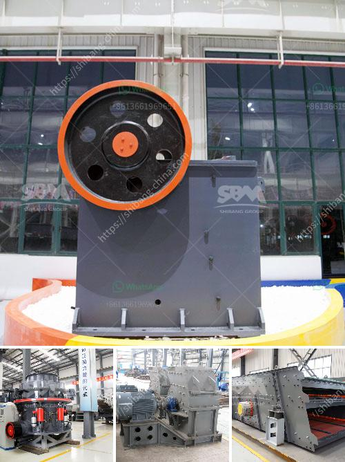

<h3>auto cad ball mill</h3>
AutoCAD is a computer-aided design (CAD) software that engineers and architects use to create 2D and 3D models of various objects. One of the objects that can be created using AutoCAD is a ball mill. As the name suggests, it is a device that uses balls to grind materials for various purposes, such as mixing chemicals, ores, paints, building materials, etc.

A ball mill typically consists of a cylindrical shell that rotates around its axis, which is partially filled with spherical or cylindrical grinding media. The material to be ground is fed into the mill through a hollow trunnion at one end and exits through a hollow trunnion at the other end. The grinding media and the material to be ground collide and crush against each other, resulting in the reduction of particle size.

When designing a ball mill using AutoCAD, there are several factors that must be considered. The first is the power requirements of the mill. Different materials and processes require different amounts of power to operate. Therefore, the motor and power transmission system must be appropriately sized to ensure efficient operation.

Additionally, the size and shape of the mill need to be selected based on the desired capacity and the size of the materials to be ground. This includes determining the appropriate diameter and length of the mill, as well as the optimal filling level of the grinding media inside the mill.

In AutoCAD, the design of the ball mill can be created using 2D drawings or 3D models, depending on the desired outcome. Based on the drawings or models, the necessary dimensions and specifications can be added to create a complete and accurate representation of the ball mill.

Once the design is complete, AutoCAD provides tools to analyze and optimize the performance of the ball mill. This includes examining the impact of different operating conditions, such as rotation speed, ball size, and filling level, on the grinding efficiency. By simulating these conditions, engineers can fine-tune the design and make necessary modifications to improve the overall performance of the ball mill.

Furthermore, AutoCAD allows for the creation of detailed assembly drawings and bill of materials, making it easier to manufacture and assemble the ball mill. These drawings can be easily shared with manufacturers or used as a reference during the production process, ensuring accurate construction and assembly.

In conclusion, AutoCAD is a powerful tool that engineers and architects can use to design and optimize a ball mill. With its wide range of features and capabilities, it enables the creation of detailed and accurate models, as well as the analysis and optimization of the mill's performance. By using AutoCAD, designers can develop efficient and reliable ball mills that meet the unique requirements of their specific applications.
<h3>Contact us</h3><ul><li><strong>Whatsapp:&nbsp;<a href="https://wa.me/8613661969651">+8613661969651</a></strong></li><li><a href="https://swt.shibang-china.com/?git&amp;zhl&amp;auto cad ball mill"><strong>Online Service(chat now)</strong></a></li></ul><h3>Related</h3><ul><li><a href='kaolin crusher plant machinery.md'>kaolin crusher plant machinery</a></li><li><a href='aggregate for cement block making.md'>aggregate for cement block making</a></li><li><a href='manufacture of conveyor belts in mexico.md'>manufacture of conveyor belts in mexico</a></li><li><a href='components of industrial conveyor belts.md'>components of industrial conveyor belts</a></li><li><a href='kaolin clay processing line.md'>kaolin clay processing line</a></li></ul>