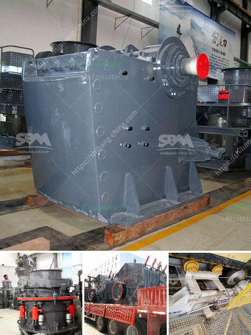

<h3>automatic rolling mill manufacturer liberia</h3>
Liberia, a country rich in natural resources, has witnessed significant growth in its industrial sector in recent years. One of the crucial components that ensure the success of this growing industrialization is the automatic rolling mill. These mills play a vital role in the manufacturing process as they produce high-quality rolled products used in various sectors like construction, automotive, and shipbuilding.

An automatic rolling mill is a technologically advanced machinery used for shaping and converting metal into different forms. It is designed to enhance productivity and efficiency in the rolling process while ensuring uniformity and precision. These mills are highly sought after by industries in Liberia as they offer a range of benefits that contribute to the growth and success of their businesses.

One of the key advantages of using an automatic rolling mill is its ability to save time and manpower. These mills can handle large volumes of metal in a continuous manner without the need for constant human intervention. The fully automated system ensures a streamlined production process, eliminating the need for manual monitoring and adjustment. This results in increased productivity, reduced labor costs, and improved overall operational efficiency.

Additionally, automatic rolling mills provide exceptional precision and accuracy in the shaping and conversion of metals. The advanced technology incorporated in these mills ensures consistent thickness and dimensions of rolled products. This uniformity is essential for industries that require precise measurements, such as the construction and automotive sectors. By using an automatic rolling mill, manufacturers in Liberia can produce high-quality products that meet industry standards and customer requirements.

Another advantage of these mills is their versatility in handling different types of metals. Whether it is steel, aluminum, copper, or any other metal, automatic rolling mills can effectively shape and convert them into desired forms. This versatility opens up a wide range of possibilities for manufacturers, allowing them to cater to various industries and meet the diverse needs of their customers.

When considering an automatic rolling mill manufacturer in Liberia, it is essential to choose a trusted and reliable supplier. The manufacturer should have a proven track record in delivering high-quality and durable mills that are designed to withstand the rigors of industrial applications. They should offer comprehensive after-sales support, including maintenance and repair services, to ensure optimal performance and longevity of the mill.

In conclusion, the demand for automatic rolling mills in Liberia is on the rise due to their numerous benefits in terms of productivity, precision, and versatility. These mills are revolutionizing the industrial sector by streamlining the rolling process and improving efficiency. Manufacturers should carefully choose a reputable automatic rolling mill manufacturer in Liberia to ensure they receive top-notch equipment that meets their specific requirements. With the right mill, Liberian industries can continue to grow and contribute to the country's economic development.
<h3>Contact us</h3><ul><li><strong>Whatsapp:&nbsp;<a href="https://wa.me/8613661969651">+8613661969651</a></strong></li><li><a href="https://swt.shibang-china.com/?git&amp;zhl&amp;automatic rolling mill manufacturer liberia"><strong>Online Service(chat now)</strong></a></li></ul><h3>Related</h3><ul><li><a href='rock hammer mill for sale.md'>rock hammer mill for sale</a></li><li><a href='aggregate washing machine for sale.md'>aggregate washing machine for sale</a></li><li><a href='stone crusher sand vs river sand for construction.md'>stone crusher sand vs river sand for construction</a></li><li><a href='used concrete crushers for sale in ontario.md'>used concrete crushers for sale in ontario</a></li><li><a href='marble and granite grinder and crusher.md'>marble and granite grinder and crusher</a></li></ul>