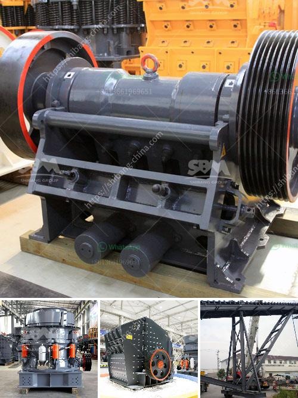

<h3>balast crushing machine kenya</h3>
Balast, or ballast, is a widely used material in the construction industry. It is a crucial component in the construction of railroad tracks, roads, and buildings. Many companies specialize in the production of balast crushers and other similar equipment used in the crushing industry.

The equipment is primarily used to produce crushed stone to be used as aggregate for various construction purposes. It can be categorized into two main types: primary and secondary crushers. Primary crushers are used to break down large stones into smaller pieces. Secondary crushers, on the other hand, are used to further refine the crushed stones into smaller sizes.

Balast crusher machines in Kenya machines are typically small in size and have the capacity to produce around 100 tons of ballast or more per hour. Ballast crusher machines require a constant power source to operate, and are capable of crushing materials such as granite, quartzite, limestone, and marble, to produce aggregate for construction purposes.

1. Material preparation: The raw materials are fed into the crusher machine and are initially crushed into smaller pieces. The size of the crushed material depends on the specific requirements and the capabilities of the machine.

2. Screening: After the initial crushing process, the crushed stones are screened to separate the desired size of ballast from the oversize material. This ensures that only the required size of ballast is produced, which is crucial for achieving the optimal quality of the end product.

3. Washing: Some ballast crusher machines also have a washing system installed, which helps in removing any impurities or dust particles from the crushed stones. This ensures that the end product is clean and of high quality.

4. Packaging: Once the ballast is crushed, screened, and washed (if required), it is packaged and stored for transportation. The ballast can be transported to construction sites via trucks, railway wagons, or ships, depending on the distance and the specific requirements of the project.

In Kenya, construction projects are booming, and there is a high demand for ballast. Therefore, the majority of companies involved in the manufacturing of balast crushing machines are located in Kenya. A few of the leading companies in this industry include Mwafrika Ballast Crushers, Beryle Engineering Limited, and Baioni Crushing Plants SPA.

These companies not only manufacture and supply ballast crusher machines but also provide after-sales services such as installation, operation training, and maintenance. They take pride in delivering high-quality machines and ensuring customer satisfaction.

In conclusion, balast crushing machines play a crucial role in the construction industry in Kenya. They are used to crush and produce ballast for various construction projects. The machines are typically small in size and have the capacity to produce around 100 tons of ballast or more per hour. Companies involved in the manufacturing of these machines are located in Kenya. They provide high-quality machines and after-sales services to ensure customer satisfaction. With the booming construction industry in Kenya, the demand for ballast crushing machines is expected to remain high in the coming years.
<h3>Contact us</h3><ul><li><strong>Whatsapp:&nbsp;<a href="https://wa.me/8613661969651">+8613661969651</a></strong></li><li><a href="https://swt.shibang-china.com/?git&amp;zhl&amp;balast crushing machine kenya"><strong>Online Service(chat now)</strong></a></li></ul><h3>Related</h3><ul><li><a href='jaw crusher 30 x 12.md'>jaw crusher 30 x 12</a></li><li><a href='jaw crusher baxter.md'>jaw crusher baxter</a></li><li><a href='buy stone crusher india.md'>buy stone crusher india</a></li><li><a href='ulltra fine grinding mill.md'>ulltra fine grinding mill</a></li><li><a href='wanted 120 ton of stone crusher.md'>wanted 120 ton of stone crusher</a></li></ul>