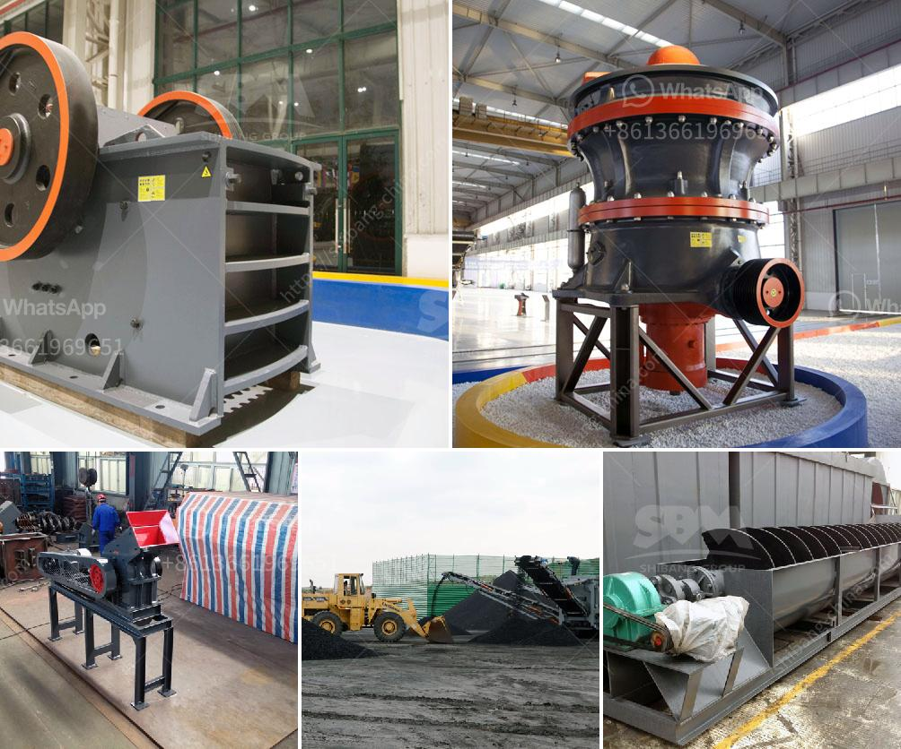

<h3>ball grinding machine in india</h3>
India, known for its vast diversity, has been a prominent hub for manufacturing ball grinding machines since decades. Today, the ball grinding machine is flourishing in India, contributing significantly to the country's economy, not only in terms of manufacturing but also exports of machinery to various overseas nations.

A ball grinding machine is a type of grinding machine used to grind and blend materials for use in mineral dressing processes, paints, pyrotechnics, ceramics, and selective laser sintering. It works by rotating on a horizontal axis, partially filled with the material to be ground, plus the grinding medium. Different materials are used as media, including ceramic balls, flint pebbles, and stainless steel balls. The ball grinding machine grinds and mixes the materials to be used for various purposes, including industrial applications, such as aerospace, automobile, and manufacturing industries.

Several factors have contributed to the significant growth of the ball grinding machine in India. Firstly, the ever-increasing demand for high-quality and precise metal processing machines has pushed manufacturers to invest in technologically advanced infrastructure. This has led to the production of state-of-the-art ball grinding machines with enhanced efficiency, accuracy, and productivity.

Moreover, India's abundant availability of skilled labor, combined with relatively lower labor costs compared to developed countries, has further propelled the manufacturing of ball grinding machines. Skilled technicians and engineers in India have been instrumental in developing and improving the technology used in these machines, ensuring they meet global standards while remaining affordable.

India has not only focused on meeting domestic demand but has also positioned itself as a leading exporter of ball grinding machines. Indian manufacturers have made a mark on the global stage, catering to the diverse needs of industries worldwide. With their competitive pricing and high-quality machines, Indian manufacturers have become reliable partners for international businesses seeking cost-effective and efficient grinding solutions.

The ball grinding machine market in India continues to witness a steady growth trajectory, thanks to the government's "Make in India" initiative, which aims to transform India into a global manufacturing hub. The government's efforts to boost manufacturing, backed by favorable policies and incentives for the industry, have attracted both domestic and foreign investments in the sector. This has not only facilitated the expansion of existing manufacturing facilities but also led to the emergence of new enterprises in the country.

Furthermore, advancements in technology, such as automation and digitalization, have played a crucial role in the development of ball grinding machines in India. Many Indian manufacturers are adopting smart technologies to improve the efficiency and accuracy of their machines, resulting in better production yields and reduced time and labor costs.

In conclusion, ball grinding machines in India have experienced remarkable growth in recent years, contributing to the growth of the manufacturing sector and the overall economy. The availability of skilled labor, advanced infrastructure, and government initiatives have led to India becoming a notable player in this industry. With continued technological advancements and increasing demand for precision machinery, the future of ball grinding machines in India looks promising.
<h3>Contact us</h3><ul><li><strong>Whatsapp:&nbsp;<a href="https://wa.me/8613661969651">+8613661969651</a></strong></li><li><a href="https://swt.shibang-china.com/?git&amp;zhl&amp;ball grinding machine in india"><strong>Online Service(chat now)</strong></a></li></ul><h3>Related</h3><ul><li><a href='quick lime production process.md'>quick lime production process</a></li><li><a href='aggregate crusher plants.md'>aggregate crusher plants</a></li><li><a href='cement ball mills charging.md'>cement ball mills charging</a></li><li><a href='vsi crusher manufacturers.md'>vsi crusher manufacturers</a></li><li><a href='double jaw crusher.md'>double jaw crusher</a></li></ul>