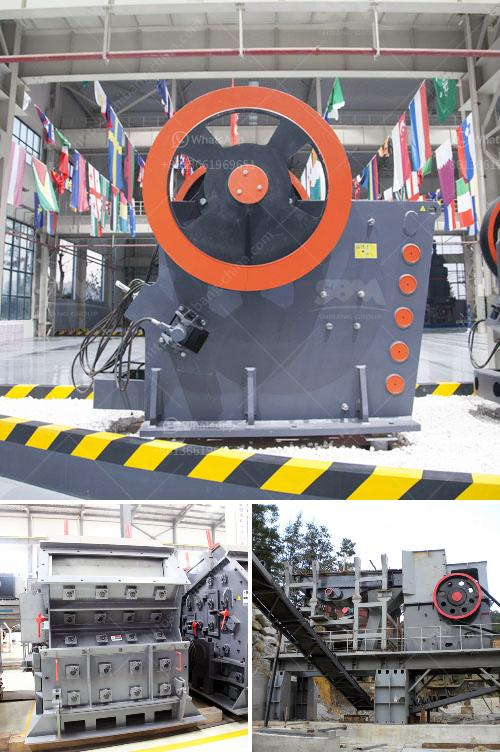

<h3>ball grinding mill buy</h3>
The ball grinding mill is a key piece of equipment utilized for grinding crushed materials. A ball grinding mill consists of a hollow cylindrical shell that rotates about its axis. It is partially filled with balls that can be made of steel, ceramic, or rubber. The inner part of the shell is usually lined with an abrasion-resistant material such as manganese steel or rubber to prevent wear and extend the equipment's lifespan. The balls employed in a ball grinding mill are typically large and heavy, causing them to impact and grind materials effectively.

Ball grinding mills are commonly used in the cement, mineral processing, chemical, and construction industries. They are also widely used in the ceramic industry for the preparation of glazes and materials for porcelain production. With the advancement of technology, ball grinding mills are now available in various designs and sizes to cater to different applications and process requirements.

One of the main advantages of using a ball grinding mill is its ability to produce finer particle sizes. By grinding materials in a ball mill, particles are reduced in size and can be further processed or used for various applications. The finer the particle size achieved, the more efficient and effective subsequent processes and applications can be. This makes ball grinding mills an essential equipment in many industries.

Another advantage of ball grinding mills is their versatility. These mills can be used for both wet and dry grinding processes. Wet grinding is suitable for materials that need to be ground and mixed with water or other liquids, while dry grinding is preferable for materials that can ignite or react with water. The ability to perform both wet and dry grinding makes ball grinding mills more flexible and adaptable to different processing requirements.

When purchasing a ball grinding mill, several factors need to be considered. The size and capacity of the mill should be chosen based on the desired output and production requirements. It is important to select a mill that can handle the desired workload without causing excessive wear and tear. The quality and durability of the mill are also crucial factors to ensure a long lifespan and consistent performance. Therefore, it is advisable to purchase from reliable and reputable manufacturers or suppliers.

Furthermore, it is essential to consider the cost-efficiency of the ball grinding mill. While initial investment is a consideration, long-term operational costs should also be taken into account. Factors such as energy consumption, maintenance, and spare parts availability can affect the overall cost of operating the mill. It is recommended to choose a mill that strikes a balance between upfront investment and long-term operational costs.

In conclusion, ball grinding mills are indispensable equipment in various industries for grinding and reducing particle sizes. Their ability to perform both wet and dry grinding makes them versatile and adaptable. When buying a ball grinding mill, factors such as size, capacity, quality, and cost-efficiency should be carefully evaluated. Choosing the right mill can not only enhance productivity but also save costs in the long run.
<h3>Contact us</h3><ul><li><strong>Whatsapp:&nbsp;<a href="https://wa.me/8613661969651">+8613661969651</a></strong></li><li><a href="https://swt.shibang-china.com/?git&amp;zhl&amp;ball grinding mill buy"><strong>Online Service(chat now)</strong></a></li></ul><h3>Related</h3><ul><li><a href='grinding and mixing machine for quartz.md'>grinding and mixing machine for quartz</a></li><li><a href='tanzania gold crusher price.md'>tanzania gold crusher price</a></li><li><a href='singapore handheld concrete crusher.md'>singapore handheld concrete crusher</a></li><li><a href='deodorization clay processing price.md'>deodorization clay processing price</a></li><li><a href='quarry crusher equipment for sale brisbane.md'>quarry crusher equipment for sale brisbane</a></li></ul>