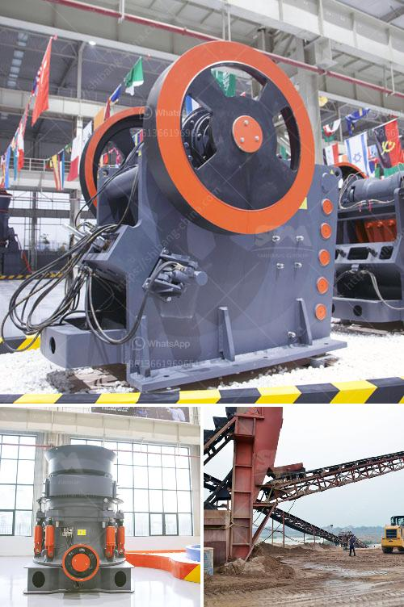

<h3>ball mill ball feeders</h3>
In the mining industry, various mining processes are undertaken to extract valuable minerals or metals from the earth. One essential tool used in this process is the ball mill. In a ball mill, a cylindrical shell rotates around its axis and the grinding medium (in this case, balls) is placed inside the shell. The grinding medium is lifted up and falls back down due to the rotation of the mill, effectively crushing the material into finer particles.

To ensure continuous operation and optimum performance of the ball mill, it is necessary to feed the balls into the mill continuously. This is where ball mill ball feeders come into play. These devices are used to feed balls (or steel grinding media) into a mill, keeping the mill running smoothly and efficiently.

The main purpose of the ball feeder is to maintain a consistent filling of balls inside the mill. The balls are transferred from the feeder to the mill by an auger or a vibrating conveyor, ensuring that the balls are evenly distributed and move freely within the mill. This prevents the balls from clumping together and enables efficient grinding.

The design of a ball feeder is crucial in ensuring proper functioning. It should have a sturdy construction to withstand the impacts of the falling balls, while also allowing for the smooth movement of the balls. Additionally, the feeder should have an adjustable feed rate to control the amount of balls entering the mill, ensuring that the mill does not get overloaded or underloaded.

One common type of ball feeder used in ball mills is a drum feeder, which consists of an endless conveyor belt that delivers the balls into the mill. This type of feeder is particularly suited for low and medium capacity mills, as it provides a consistent feed rate over a relatively long period of time. Another type of feeder is the spout feeder, which utilizes a spout to deliver the balls into the mill. This type of feeder is typically used in high capacity mills where a large volume of balls needs to be fed.

Proper maintenance and regular inspection of the ball mill ball feeders are critical in ensuring their efficient operation. The feeders should be checked for any signs of wear and tear, as well as any buildup of debris or blockage that may hinder the movement of balls. It is also important to keep the feeders clean and lubricated to prevent any friction or jamming.

In conclusion, ball mill ball feeders are essential components in the ball mill grinding process. Their purpose is to maintain a continuous feed of balls into the mill, ensuring optimal grinding performance. Various types of feeders are available, each suitable for different mill capacities. Regular maintenance and inspection are necessary to ensure the smooth operation of the feeders. By understanding the importance of ball feeders, mining operations can maximize the efficiency of their ball mills and ultimately achieve better results.
<h3>Contact us</h3><ul><li><strong>Whatsapp:&nbsp;<a href="https://wa.me/8613661969651">+8613661969651</a></strong></li><li><a href="https://swt.shibang-china.com/?git&amp;zhl&amp;ball mill ball feeders"><strong>Online Service(chat now)</strong></a></li></ul><h3>Related</h3><ul><li><a href='gold processing methods iron slag.md'>gold processing methods iron slag</a></li><li><a href='vail crushing meachine models in pharma.md'>vail crushing meachine models in pharma</a></li><li><a href='mining equipment tanzania.md'>mining equipment tanzania</a></li><li><a href='ball mill pictures.md'>ball mill pictures</a></li><li><a href='purchase of cement crusher machines.md'>purchase of cement crusher machines</a></li></ul>