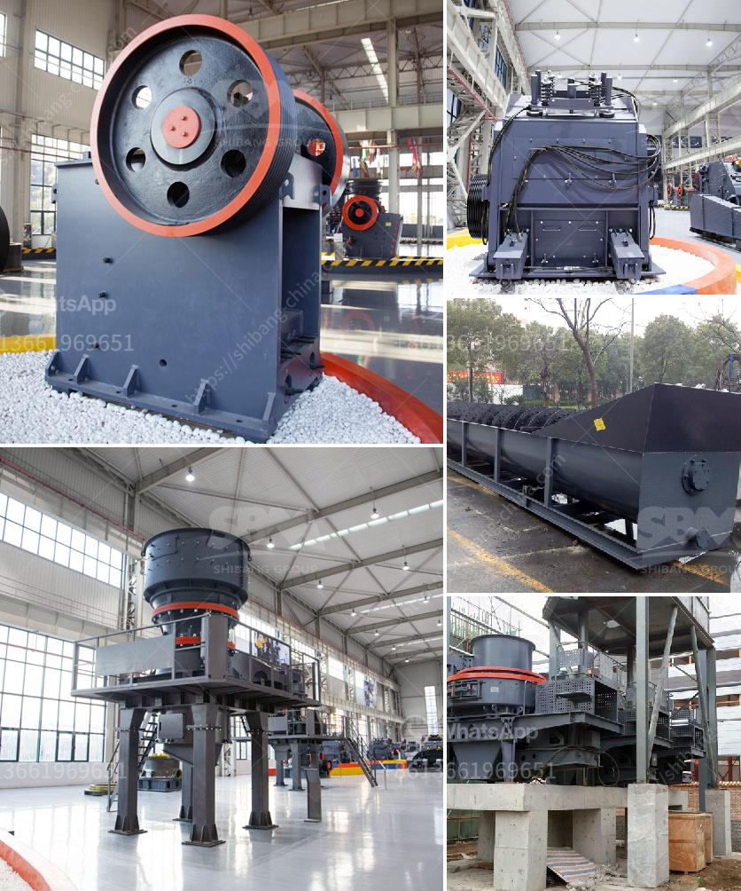

<h3>ball mill ball manufacturer in mumbai</h3>
A ball mill is a type of grinding equipment used to reduce the size of material into very fine particles. Ball mills are cylindrical in shape and are often the grinder of choice when it comes to mashing paints, ores, ceramic materials, and certain hard chemicals. By rotating on a horizontal axis, a ball mill can effectively convert a hard material into a loose powder.

Ball mill balls are manufactured to be a part of this process. They can be made from a variety of ceramic materials including aluminum oxide, silicon nitride, and zirconium oxide. Steel and other metal balls are also used in certain applications. The ball mill balls suppliers in Mumbai manufacture them by utilizing the most recent machinery and technologies available.

The ball mill balls manufacturers have internal geometries that allow the balls to be ground down to a uniform size. During the ball milling process, the collision between the tiny, rigid balls within the cylinder grinds material into a fine powder. The powder form of material is swept out of the mill, which is then collected and stored in a hopper.

To manufacture these ball mill balls, the ball mill manufacturers in Mumbai take immense care to ensure that these balls are manufactured in line with the desirable industry standards. These manufacturers make use of premium-grade steel for manufacturing the balls. The quality of steel ensures that the balls are able to withstand the heaviness of the material to be crushed, which further ensures durability and strong ball mill performance.

The ball mill balls manufacturers can customize them as per the specific requirements of individual applications. For example, a ball mill may be converted into a SAG mill, which adds another dimension to the grinding process, and enhances the performance of the ball mill.

Ball mill balls manufacturers in Mumbai should be aware of the laws governing the importing and exporting of steel balls. A ball mill is similar to a rod mill but it uses steel balls instead of rods to supply the energy required to grind the ore. Its quality determines the quality of the product. Therefore, in order to purchase ball mill balls manufacturer in Mumbai, one should consider the quality indicators of the steel ball.

In Mumbai, there are several ball mill balls manufacturers. They manufacture all kinds of mill balls with different specifications, including low, medium, and high chrome balls. These balls are used in various grinding and milling applications, including mining, cement factories, and power plants.

In conclusion, ball mill balls are a critical component for grinding and pulverizing materials in a ball mill. They are made of various materials like steel, ceramic, and chrome. The ball mill balls manufacturers in Mumbai manufacture these balls with high precision and quality standards. This ensures that the balls are able to perform optimally, and rotate with minimal friction and resistance. The ball mill balls suppliers in Mumbai are known for their high-quality products that last longer, and are resistant to wear and tear.
<h3>Contact us</h3><ul><li><strong>Whatsapp:&nbsp;<a href="https://wa.me/8613661969651">+8613661969651</a></strong></li><li><a href="https://swt.shibang-china.com/?git&amp;zhl&amp;ball mill ball manufacturer in mumbai"><strong>Online Service(chat now)</strong></a></li></ul><h3>Related</h3><ul><li><a href='track mounted coal crushers indonesia.md'>track mounted coal crushers indonesia</a></li><li><a href='cost of vertical raw mill.md'>cost of vertical raw mill</a></li><li><a href='mobile crushing and screening in malaysia.md'>mobile crushing and screening in malaysia</a></li><li><a href='price crusher mill price stone crusher.md'>price crusher mill price stone crusher</a></li><li><a href='cone crusher sri lanka for sale.md'>cone crusher sri lanka for sale</a></li></ul>