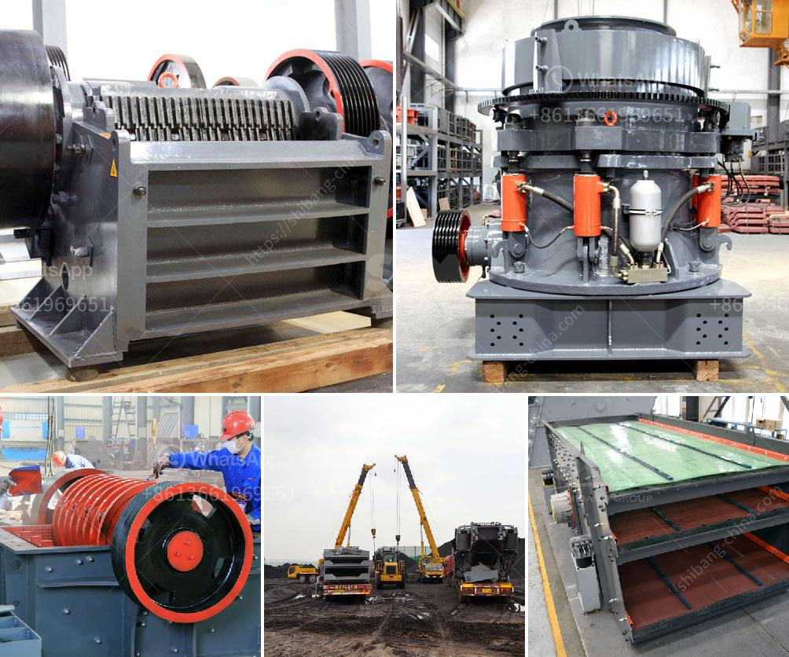

<h3>ball mill capacity 10 tph in malaysia</h3>
The ball mill is widely used in metallurgy, mining, chemical, cement, construction, industrial and mining industries etc. Ball Mill is crucial equipment for grinding after materials are crushed. It is an efficient tool for grinding various materials into powder.

1. The main bearings of ball mill are based on sliding bearings. The balls are placed in the groove of the bearing track and the bearings lubricate the balls for smooth operation. When the ball mill works, the noise is reduced by 10 decibels.

2. The ball mill uses a rubber lining, which is more wear-resistant and impact-resistant than the ordinary lining. The noise is reduced by 20 decibels, making it more environmentally friendly and low-cost.

3. The ball mill has high grinding efficiency and large output capacity. Compared with other grinding methods, the energy consumption is reduced by 20-30%. The rotation speed of the grinding cylinder is variable, which can achieve the best grinding effect through the optimal speed ratio.

4. The system is equipped with dust removal equipment to achieve a clean production environment. The dust removal efficiency is as high as 99.99%.

Malaysia, as an important mining country in Southeast Asia, has large gold reserves. Gold mining machinery and equipment are mainly used for mineral ore concentration, such as crushing and screening. Crushing is the first stage which processes the gold ore into smaller sizes for further grinding and beneficiation process.

Ball mill capacity 10 tph is suitable for medium and fine crushing. It mainly consists of feeding device, discharge device, rotating device, transmission device (reducer, pinion, motor, electric control) and so on. The hollow shaft is made of cast steel, the inner lining can be replaced, and the rotary large gear is processed by casting hobbing. The wear-resistant liner is introduced to reduce the maintenance cost and save energy.

In recent years, with the rapid development of Malaysia's economy and infrastructure construction, the demand for sand and stone materials has increased significantly. As an important raw material in the construction industry, natural sand has been exhausted, which leads to the increasing demand for artificial sand. The ball mill is widely used in the production of artificial sand.

In addition, the ball mill can also be used for the production of refractory materials, cement, steel grit, slag powder, copper ore, iron ore, gold ore, concrete aggregate, asphalt aggregate and other materials. It has a wide range of applications in various industries.

In conclusion, the ball mill with a capacity of 10 tph in Malaysia is suitable for small-scale production lines. It has the advantages of stable operation, low energy consumption, and high grinding efficiency. The choice of equipment should be based on the size of the material, hardness, yield requirements, and other factors. It is crucial to select the appropriate equipment to maximize the production efficiency and economic benefits.
<h3>Contact us</h3><ul><li><strong>Whatsapp:&nbsp;<a href="https://wa.me/8613661969651">+8613661969651</a></strong></li><li><a href="https://swt.shibang-china.com/?git&amp;zhl&amp;ball mill capacity 10 tph in malaysia"><strong>Online Service(chat now)</strong></a></li></ul><h3>Related</h3><ul><li><a href='mobile stone crushing plant.md'>mobile stone crushing plant</a></li><li><a href='ball mill in malaysia.md'>ball mill in malaysia</a></li><li><a href='buy ballast crusher.md'>buy ballast crusher</a></li><li><a href='used crusher for sale in dubai.md'>used crusher for sale in dubai</a></li><li><a href='kolberg pioneer ft4240 impact crusher.md'>kolberg pioneer ft4240 impact crusher</a></li></ul>