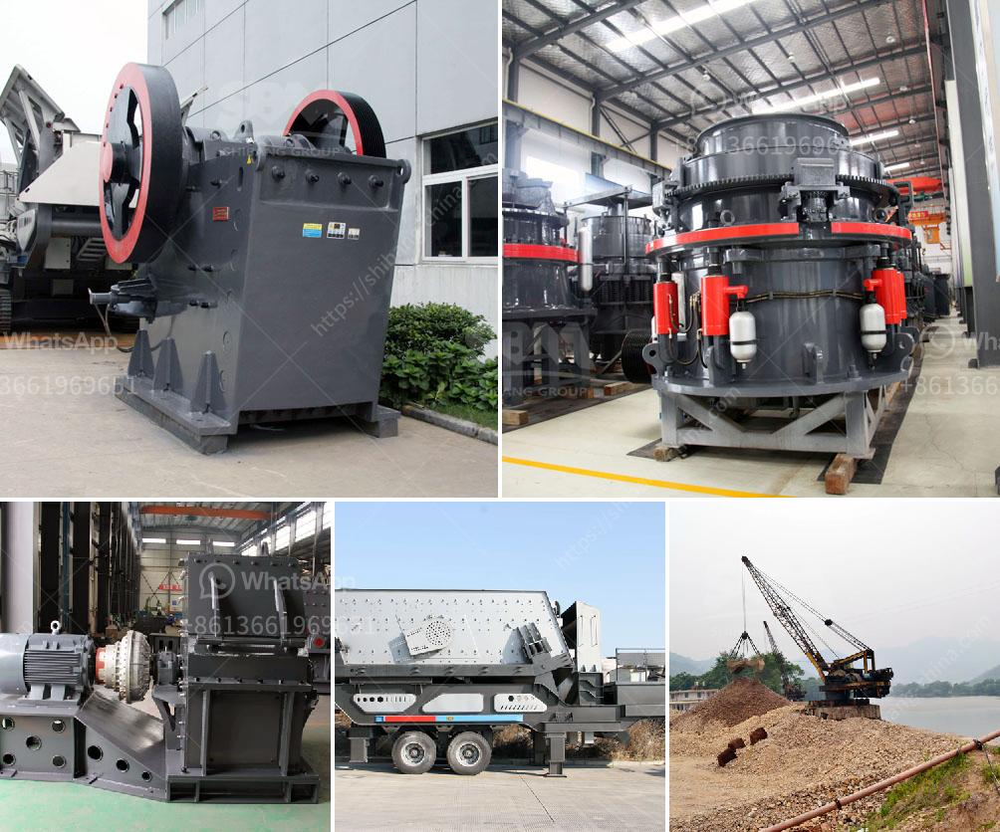

<h3>ball mill capacity of tons</h3>
The ball mill is a vital piece of equipment in the mining industry. It is used to grind and crush materials into smaller particles for further processing. However, determining the ball mill capacity is a challenging task due to complex pulp fluidity, grinding media mass, and ore variable properties.

The capacity of the ball mill is commonly expressed in terms of tons per hour (TPH). Depending on the mill size, the calculation can be quite complicated, requiring detailed knowledge of the input and output grind size, ore characteristics, and mill dimensions. Nevertheless, a rough estimate can be made based on average values.

A capacity of tons refers to the maximum amount of material that can be processed per hour. The higher the capacity, the more efficient the mill is in grinding the ore. This efficiency is crucial for maximizing the production output and ensuring profitability in the mining operation.

To calculate the ball mill capacity in tons, one must assume an ideal process condition. For example, the ball mill is operating at a steady-state with a specific grind size and feed rate. Under these conditions, the grinding efficiency is at its peak, resulting in maximum tonnage per hour.

1. Mill dimensions: The physical size of the mill affects its capacity. Larger mills can handle more material and have higher tonnage capabilities.

2. Mill speed: The rotational speed of the mill directly affects the grinding efficiency. Increasing the mill speed generally leads to higher capacity, as more material is processed within a given time frame.

3. Ball load: The amount of grinding media inside the mill impacts the capacity. A higher ball load results in more impacts and grinding action, increasing the capacity.

4. Ore feed rate: The rate at which ore is fed into the mill determines how much material can be processed. A higher feed rate generally leads to higher capacity.

5. Grind size: The size of the final product desired from the mill affects its capacity. Finer grind sizes require more energy and time to achieve, reducing the overall capacity.

6. Pulp density: The density of the pulp inside the mill affects the grinding efficiency. Higher pulp density can improve capacity, as more material is transported by the slurry.

In conclusion, determining the ball mill capacity in tons is a complex task that requires considering various factors such as mill size, speed, ball load, ore feed rate, grind size, and pulp density. While a rough estimate can be made based on average values, an accurate calculation should account for specific process conditions and ore properties. As the mining industry seeks to optimize operations and increase production, the ball mill's capacity plays a critical role in achieving these goals.
<h3>Contact us</h3><ul><li><strong>Whatsapp:&nbsp;<a href="https://wa.me/8613661969651">+8613661969651</a></strong></li><li><a href="https://swt.shibang-china.com/?git&amp;zhl&amp;ball mill capacity of tons"><strong>Online Service(chat now)</strong></a></li></ul><h3>Related</h3><ul><li><a href='coal processing machine.md'>coal processing machine</a></li><li><a href='auto cad ball mill.md'>auto cad ball mill</a></li><li><a href='granite quarry in nigeria.md'>granite quarry in nigeria</a></li><li><a href='coal crusher suppliers.md'>coal crusher suppliers</a></li><li><a href='iron ore used crusher machine.md'>iron ore used crusher machine</a></li></ul>