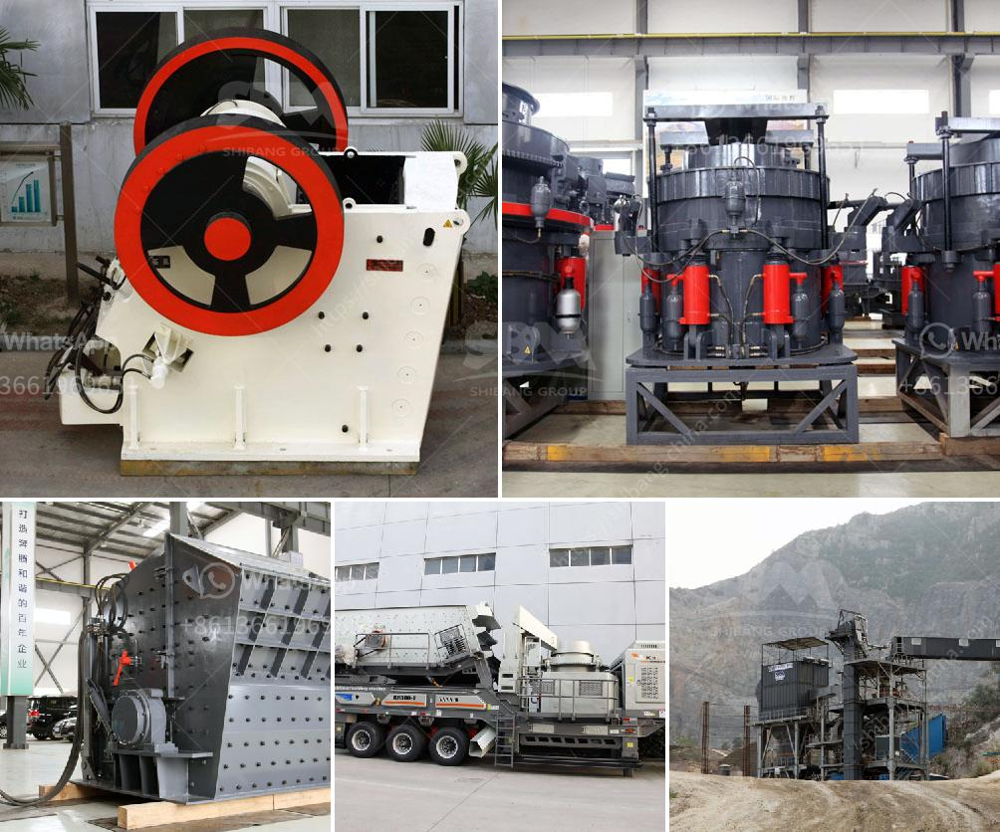

<h3>ball mill capacity tons</h3>
The ball mill is a key equipment to grind the crushed materials, and the ball mill is widely used in powder-making production line including cement, silicate, new-type building material, refractory material, fertilizer, ore dressing of ferrous metal and non-ferrous metal, glass ceramics, etc. And the ball mill can grind various ores and other materials with dry type and wet type. There are two kinds of ball mill, grate type and overfall type due to different ways of discharging material.

The ball mill has a certain capacity, but with a certain ball charge and power input, the capacity will change. The capacity is affected by various factors such as the feed size, the grinding media distribution, and the shape of the liner plate. Also, the rotation speed of the ball mill will affe

The capacity of the ball mill is typically measured in tons per hour or tons per day, but this depends on the type and size of mill being used. The output of the ball mill is directly linked to the grinding media used, and the efficiency of grinding. Therefore, it is important to choose the right grinding media for the ball mill.

The most commonly used grinding media in ball mills are stainless steel balls, ceramic balls, and flint pebbles. The size of the grinding media depends on the size of the particles being ground. As the ore particles in the feed are reduced in size due to the impact and grinding action of the grinding media, the capacity of the ball mill increases.

The shape of the liner plate also affects the capacity of the ball mill. Different types of liner plates can be used to adjust the grinding media distribution inside the mill and to provide different lifting effects for the grinding media. This can result in different capacities for the same mill size.

The rotation speed of the ball mill also affects the capacity. Increasing the rotation speed will increase the impact and grinding action of the grinding media, resulting in a higher capacity. However, increasing the rotation speed too much can cause the grinding media to be thrown out of the mill, reducing the capacity.

In summary, the capacity of the ball mill is determined by various factors such as the feed size, grinding media distribution, liner plate shape, and rotation speed. It is important to optimize these factors to achieve the maximum capacity for a given mill size. This can be done through careful selection of grinding media and liner plates, as well as adjusting the rotation speed to find the optimal balance between grinding efficiency and capacity.
<h3>Contact us</h3><ul><li><strong>Whatsapp:&nbsp;<a href="https://wa.me/8613661969651">+8613661969651</a></strong></li><li><a href="https://swt.shibang-china.com/?git&amp;zhl&amp;ball mill capacity tons"><strong>Online Service(chat now)</strong></a></li></ul><h3>Related</h3><ul><li><a href='dust cover for screening and crushing plant.md'>dust cover for screening and crushing plant</a></li><li><a href='germany gypsum board manufacturing equipment.md'>germany gypsum board manufacturing equipment</a></li><li><a href='cost or operating stone quarry and crusher.md'>cost or operating stone quarry and crusher</a></li><li><a href='quarry equipment for hire in nigeria.md'>quarry equipment for hire in nigeria</a></li><li><a href='crushing plant layout.md'>crushing plant layout</a></li></ul>